# Kawa 設計思想メモ

## 1. 概要

**Kawa** は、ASP.NET Core の上に構築する、軽量な contract-first / usecase-first の .NET Web フレームワークである。

目的は、ASP.NET Core を置き換えることではない。  
むしろ、ASP.NET Core の強力な基盤を活かしつつ、Web アプリケーション開発における以下の課題を整理することにある。

- HTTP 層とドメインロジックの混在
- Controller / Endpoint に業務ロジックが流れ込む問題
- C# / F# / VB.NET など、CLR 言語の混在利用の難しさ
- Web API / RPC / Worker など複数の入口に対するロジックの再利用性
- DTO、UseCase、Validation、Result、Error Handling の統一不足
- 人間と AI のどちらにとっても読み取りやすい規約の不足
- .NET における Rails 的な導線の弱さ

Kawa は、これらに対して「川」のような設計を目指す。

- Contract は水路である。
- UseCase は流れである。
- Web Endpoint は水門である。
- Core は水の流れを濁らせない河床である。
- C# / F# / VB.NET などの CLR 言語は、同じ水系に合流する支流である。

Kawa は、支配するフレームワークではなく、流れを整えるフレームワークである。

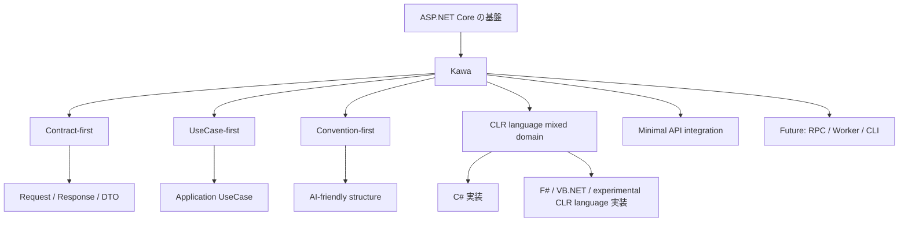

---

## 2. 基本理念

### 2.1 ASP.NET Core を置き換えない

Kawa は Web サーバーやフルスタック基盤を再発明しない。

ASP.NET Core が既に提供している以下の機能は、そのまま活かす。

- Hosting
- Dependency Injection
- Configuration
- Logging
- Middleware
- Routing
- Minimal API
- OpenAPI
- Authentication / Authorization
- gRPC / SignalR などの拡張基盤

Kawa が提供するのは、これらの上に乗る薄いアプリケーション層である。

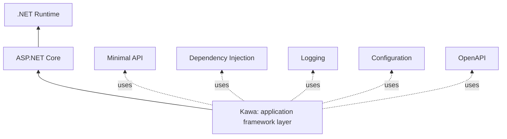

Kawa の役割は、ASP.NET Core の機能を奪うことではなく、アプリケーションの流れを整理することである。

---

### 2.2 contract-first / usecase-first

Kawa では、Web Endpoint や Controller を中心に設計しない。

中心に置くのは、以下の三つである。

- Request
- Response
- UseCase

UseCase は、1 つの業務目的を完結させる最小単位である。

Web API や RPC API は、UseCase を外部に公開するための入口にすぎない。

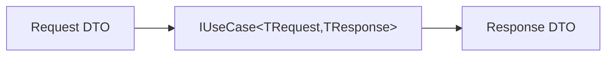

HTTP、RPC、CLI、Worker などは、この流れに対する異なる入口である。

そのため、UseCase は以下を知らない。

- HTTP
- ASP.NET Core
- Controller / Minimal API
- RPC サービス定義 / proto 定義

Transport は、UseCase を呼び出す Adapter として扱う。

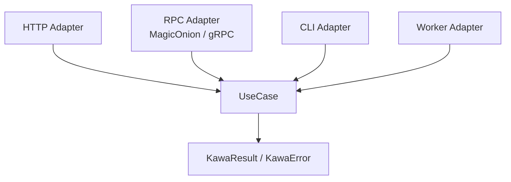

---

### 2.3 規約ファースト / AI フレンドリー

Kawa は、設定より規約を優先する。

規約は、人間の開発者だけでなく、AI アシスタントにとっても読み取りやすい形で固定する。

Kawa における AI フレンドリーとは、特別な AI 機能を持つことではない。

ファイル名、型名、責務、実行順序、エラー表現、Transport 境界が予測可能であることを意味する。

基本規約は次の通り。

- `Contracts/` ディレクトリに Kawa の `Request` と `Response` を置く
- `UseCases/` ディレクトリに 1 ファイル 1 UseCase を置く
- `Endpoints/` ディレクトリに Transport ごとの入口を置く
- `Transports/` ディレクトリに Result / Error / Transport mapping を置く
- UseCase 名、Request、Response、Error、Test 名を対応させる
- UseCase の入力、出力、失敗、依存、実行順序を同じ場所から追えるようにする
- Validation、Authorization、Transaction、Logging、Error handling は Pipeline として前面に出す
- HTTP / RPC / CLI / Worker は UseCase を呼ぶ Transport Adapter として統一する
- Transport 固有の都合を UseCase の設計に持ち込まない

この規約により、開発者も AI も「どこを見れば何が分かるか」を予測できる。

例:

```csharp
// Contracts/Users/CreateUser.cs
public static class CreateUser
{
    public sealed record Request(string Name);

    public sealed record Response(string Message);
}

// UseCases/Users/CreateUserUseCase.cs
public sealed class CreateUserUseCase
    : IUseCase<CreateUser.Request, CreateUser.Response>
{
    public Task<KawaResult<CreateUser.Response>> ExecuteAsync(
        CreateUser.Request request,
        CancellationToken cancellationToken = default)
    {
        // application flow
    }
}
```

詳細な Rails 的規約案は [Rails-like Convention Proposal](rails-like-conventions.ja.md) にまとめる。

---

### 2.4 CLR 言語を同じ水系に流す

Kawa は、C# だけで 100% 成立することを前提にする。すべての主要な設計は、C# だけでも自然に書けることを保証する。

そのうえで、F#、VB.NET、その他の CLR 上で動く言語が得意な開発者が、境界を守る限り自然にその言語を選べることも重視する。

F# は特に、ドメインモデル、Domain DSL、複雑な業務ルール、状態遷移、検証、権利判定、料金計算などに向いている。
VB.NET も、既存資産やチームの習熟度によっては通常の実装対象になり得る。
IronPython のような言語は、当面は実験的な実装対象として扱う。
[MRubyCS](https://github.com/hadashiA/MRubyCS) は、通常の CLR 言語実装というより、MRuby で動く Rails 風 DSL / scripting adapter の実験対象として扱う。

ただし、各言語の固有型やランタイム表現をそのまま C# の公開 API に漏らしすぎない。

逆に、C# の都合だけで各言語の表現力を殺しすぎない。

そのため、Kawa の境界は C# friendly な型で定義する。

- interface
- record
- enum
- class
- simple DTO

一方で、ドメイン境界の内側では各言語の表現を自由に使える。

- discriminated union
- option
- result
- function composition
- pattern matching
- language-specific domain model

設計原則は次の通り。

> 外側は単純に、内側は自由に。

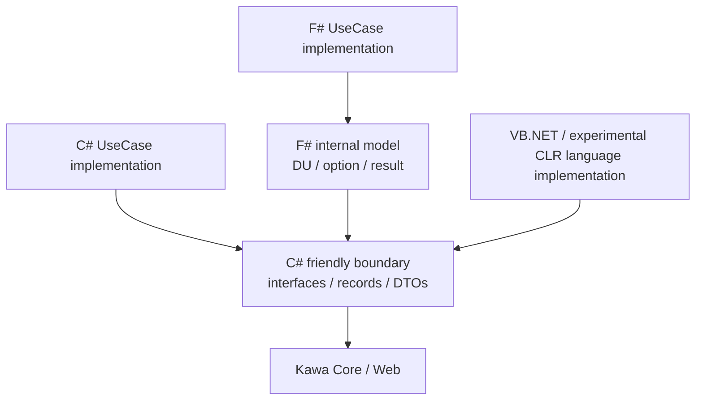

---

### 2.5 Minimal API を主軸にする

Kawa の Web 統合は、ASP.NET Core Minimal API を主軸にする。

理由は、Minimal API が薄く、UseCase を HTTP に接続するための水門として扱いやすいためである。

Controller は Kawa の中心ではない。  
ただし、既存 ASP.NET Core プロジェクトとの互換や移行のために、将来的に Controller Adapter を用意する余地は残す。

基本方針は次の通り。

- Kawa 本体は Minimal API ベース
- Controller は互換レイヤー
- Web 層にはドメインロジックを書かない
- HTTP は UseCase への入口に限定する

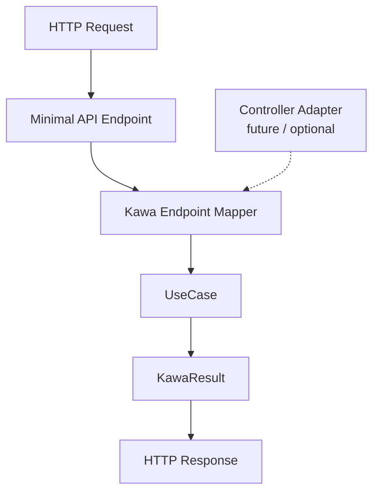

---

### 2.6 薄く、小さく始める

Kawa は最初から巨大なフレームワークにしない。

最初の MVP では以下を扱う。

- UseCase 抽象
- Result / Error モデル
- UseCaseExecutor
- Minimal API へのマッピング
- DI からの UseCase 解決
- HTTP Result への変換
- C# UseCase サンプル
- F# UseCase サンプル

最初の段階では、以下は扱わない。

- EF Core 統合
- 認証・認可
- Controller 統合
- MagicOnion / gRPC 統合
- CLI
- コード生成
- テンプレート
- 複雑な Validation
- MediatR 依存

Kawa は大運河ではなく、小さな水源から始める。

---

## 3. レイヤー構造

Kawa の基本レイヤーは以下の通り。

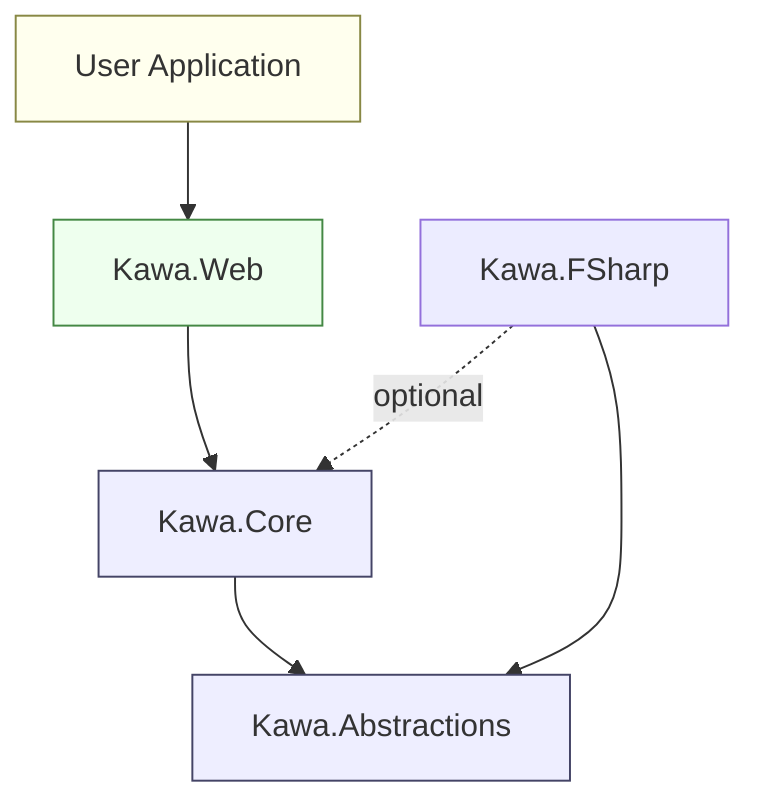

依存方向は一方向である。  
下位層は上位層を知らない。

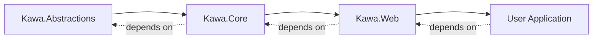

---

### 3.1 Kawa.Abstractions

#### 目的

Kawa 全体で共有する、最小限の公開契約を定義する。

この層は最も安定しているべきであり、ASP.NET Core や Web の概念を持たない。

#### 含むもの

- `IUseCase<TRequest, TResponse>`
- `KawaResult<T>`
- `KawaError`
- `KawaErrorKind`
- 必要最小限の共通 DTO / interface

#### 依存ルール

- ASP.NET Core に依存しない
- Kawa.Web に依存しない
- EF Core に依存しない
- Infrastructure に依存しない
- F# などの言語固有型を公開 API にしない

---

### 3.2 Kawa.Core

#### 目的

HTTP に依存しない、Kawa の中核処理を提供する。

UseCase の実行、Pipeline、Result 処理などを担当する。

#### 含むもの

- `UseCaseExecutor`
- Pipeline composition
- Result utilities
- Validation hook の抽象
- Error handling の共通処理

#### 依存ルール

- Kawa.Abstractions に依存してよい
- ASP.NET Core に依存しない
- Kawa.Web に依存しない
- Infrastructure に依存しない

---

### 3.3 Kawa.Web

#### 目的

ASP.NET Core Minimal API と Kawa Core を接続する。

HTTP Request を UseCase に流し、UseCase の結果を HTTP Response に変換する。

#### 含むもの

- `MapKawaPost<TRequest, TResponse>`
- `MapKawaGet<...>` などの将来的拡張
- `KawaResult<T>` から `IResult` への変換
- `AddKawa()` による Dependency Injection 登録
- OpenAPI metadata hook
- Contract-first OpenAPI document generation
- Swagger UI / ReDoc の既定セットアップ
- Minimal API endpoint registration

#### 依存ルール

- ASP.NET Core に依存してよい
- Kawa.Abstractions に依存してよい
- Kawa.Core に依存してよい
- ドメインロジックを持たない

---

### 3.3.1 OpenAPI / Swagger / ReDoc 統合

Kawa.Web は、OpenAPI を contract-first に扱う。

OpenAPI document の情報源は、Endpoint 実装ではなく Kawa の `Request` / `Response` contract である。
`MapKawaPost<TUseCase>` などの mapping API は、UseCase が実装する `IUseCase<TRequest,TResponse>` から request schema、response schema、error schema を推論し、Minimal API の OpenAPI metadata として登録する。

Kawa.Web をセットアップした時点で、開発者が追加設定なしに API contract を確認できる状態を目指す。

既定の方針:

- `AddKawa()` は Kawa の OpenAPI metadata provider を登録する
- `AddKawaWeb()` または将来の Web setup API は ASP.NET Core の OpenAPI services を登録する
- `MapKawaPost<TUseCase>` は `TRequest` / `TResponse` を OpenAPI schema に反映する
- development 環境では Swagger UI と ReDoc を既定で有効にする
- production 環境では UI 公開を明示 opt-in にする
- OpenAPI document は `/openapi/{documentName}.json` を既定候補にする
- Swagger UI は `/swagger`、ReDoc は `/redoc` を既定候補にする

OpenAPI の責務分担:

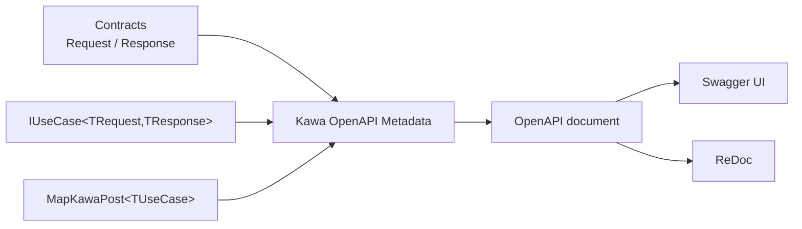

Endpoint は route と transport binding を表すが、API schema の中心ではない。
API schema は Contract から始まり、Endpoint はその Contract をどの URL / method で公開するかを宣言する。

したがって、OpenAPI のために `CreateUserHttpRequest` や `CreateUserSwaggerDto` のような別 DTO を作ることは原則として避ける。
Transport 固有の入力表現が必要な場合も、Kawa の `Request` / `Response` へ変換した上で OpenAPI 上の中心 contract を保つ。

---

### 3.4 Kawa.FSharp

#### 目的

F# で Kawa の UseCase やドメインロジックを書きやすくする。

F# サポートは任意であり、Kawa の中核に強制しない。

#### 含むもの

- F# から `IUseCase<TRequest,TResponse>` を実装しやすくする補助
- F# `Result` / `Option` と `KawaResult<T>` の変換
- F# friendly helper
- F# sample support

#### 依存ルール

- Kawa.Abstractions に依存してよい
- 必要なら Kawa.Core に依存してよい
- 原則として Kawa.Web に依存しない
- F# 固有概念を Kawa.Abstractions に漏らさない
- 他の CLR 言語サポートも、言語固有概念を Kawa.Abstractions に漏らさない

---

## 4. 基本的な処理の流れ

Kawa の基本処理は次のようになる。

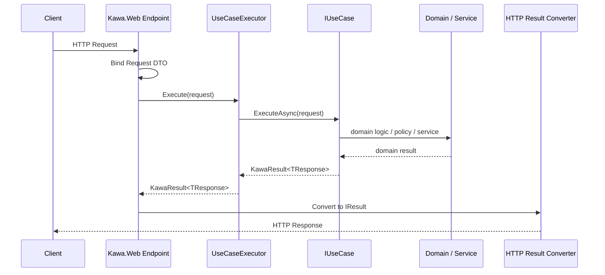

この流れにより、HTTP 層と UseCase 層を分離する。

UseCase は、HTTP から呼ばれていることを知らなくてよい。

---

## 5. One-way Flow 原則

Kawa では、処理の流れを原則として一方向に保つ。

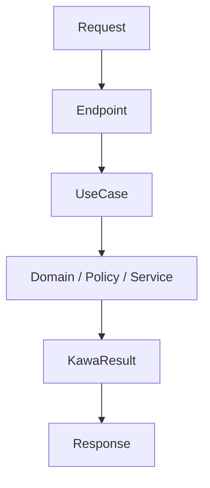

下位層は上位層を知らない。  
Domain は Web を知らない。  
Core は ASP.NET Core を知らない。  
UseCase は HTTP を知らない。

これは「戻り値が返らない」という意味ではない。  
**依存方向と責務の知識が逆流しない**という意味である。

> 川は逆流しない。

---

## 6. Composition over orchestration

Kawa では、個々の役割を小さなクラスや関数に閉じ込める。  
ただし、業務フロー全体を隠蔽しすぎない。

- 小さな責務は下位クラスに隠蔽する
- UseCase はそれらの組み合わせを明示する
- DI は依存解決に使う
- 業務上の順序や判断を DI 設定に押し込めない
- 抽象化は差し替え可能性が必要な場所に限る

ソースファイルも同じ規律に従う。

- 1 つの UseCase は、原則として 1 つのソースファイルで完結させる
- 1 つのソースファイルは 1 つの明確な責務を果たす
- ファイル名はその責務を表し、通常は主となる型や module の名前と対応させる
- UseCase ファイルには、その UseCase の入力、出力、主要な失敗、実行フローが分かる情報を集約する
- Contract、Result、Error、UseCase、Endpoint、Test は、同居によって責務や目的が曖昧になるなら分割する
- 分割することでかえって責務が見えにくくなる場合に限り、密接な補助コードを同じファイルに置いてよい

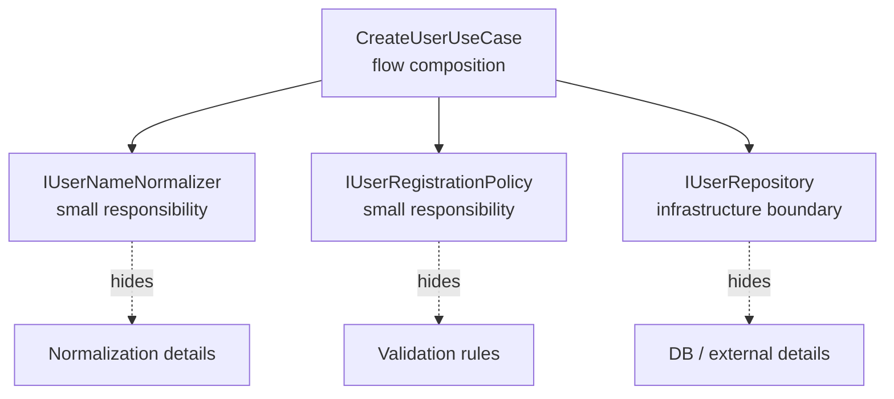

設計標語：

> 個々の責務は隠蔽する。  
> 流れは隠蔽しすぎない。

---

## 7. Result / Error モデル

Kawa では例外を乱用しない。

業務上予測可能な失敗は `KawaResult<T>` と `KawaError` で表現する。

例：

- Validation error
- Not found
- Unauthorized
- Forbidden
- Conflict
- Domain rule violation
- Unknown error

HTTP 変換の基本ルールは以下の通り。

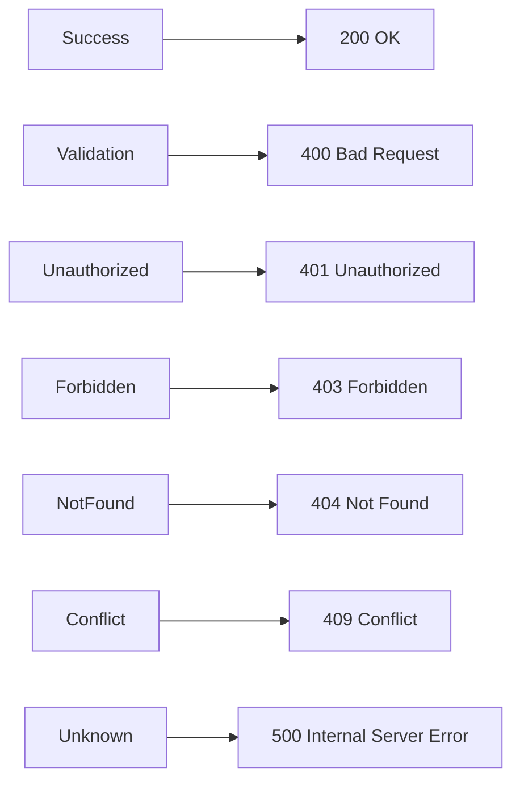

この変換は Kawa.Web が担当する。  
Kawa.Core は HTTP ステータスコードを知らない。

---

## 8. CLR 言語混在方針

### 8.1 境界は C# friendly にする

公開 API は C# から自然に扱える形にする。

```csharp
public interface IUseCase<TRequest, TResponse>
{
    ValueTask<KawaResult<TResponse>> ExecuteAsync(
        TRequest request,
        CancellationToken cancellationToken);
}
```

これにより、C#、F#、VB.NET、その他の CLR 言語でも同じインターフェースを実装できる。

Kawa における言語混在の単位は、source file ではなく project / assembly とする。

.NET の実用上の単位は「1 project = 1 language compiler」であるため、1 つの `.csproj` / `.fsproj` / `.vbproj` の中に複数言語を混ぜることを標準規約にはしない。
代わりに、1 つの solution / application の中に C#、F#、VB.NET の project を並べ、それぞれが同じ C# friendly contract boundary を参照する。

推奨構成は次の通り。

```text
MyApp.Contracts        # C#。Request / Response / Error contracts
MyApp.UseCases.CSharp  # C# UseCase implementation
MyApp.UseCases.FSharp  # F# UseCase / domain rules
MyApp.UseCases.VB      # VB.NET UseCase implementation
MyApp.Web              # ASP.NET Core / Kawa.Web endpoints
MyApp.Cli              # optional CLI adapter
MyApp.Worker           # optional Worker adapter
```

依存方向は、常に contract-first にする。

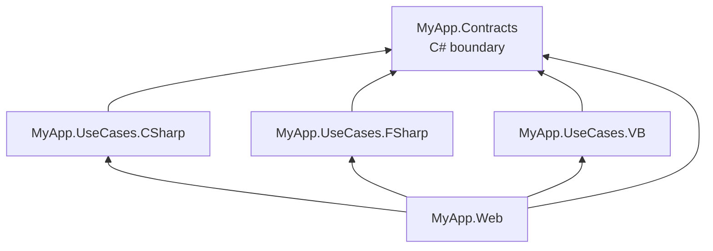

この構成により、Web / RPC / CLI / Worker は各 UseCase の実装言語を知らず、`IUseCase<TRequest,TResponse>` と Kawa の `Request` / `Response` だけを見る。

---

### 8.2 F# は内部表現で力を発揮する

F# 側では、判別共用体、option、result、関数合成を活用してよい。

F# は、Domain DSL や複雑な業務ルールに限らず、ドメインモデルとして境界の内側に閉じ込められるなら、より広く選択してよい。
重要なのは「F# を使うかどうか」ではなく、「F# 固有の表現が Kawa の公開境界を越えないこと」である。

C# で十分に明瞭な UseCase や Adapter を、F# に寄せる必要はない。
同時に、F# が得意な開発者がドメイン境界内で F# を選ぶことも妨げない。

ただし、Web や外部公開境界に出す前に、C# friendly な DTO や `KawaResult<T>` に変換する。

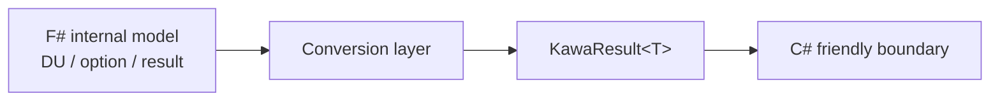

---

### 8.3 その他の CLR 言語も境界内で扱う

同じ方針は F# 以外の CLR 言語にも適用する。

VB.NET は、C# と同じく .NET の通常の開発言語として扱ってよい。
VB.NET で UseCase やドメインモデルを書く場合も、境界は C# friendly な interface / record / class / DTO / `KawaResult<T>` に合わせる。

IronPython などは、当面は実験的な実装対象として扱う。
これらの言語で書いたドメインロジックも、Kawa の公開境界に出る前に C# friendly な契約へ変換する。

[MRubyCS](https://github.com/hadashiA/MRubyCS) を扱う場合は、Ruby で Kawa の UseCase を直接実装することを第一目的にしない。
むしろ、MRuby で実行できる範囲に限定して、Rails 互換風の小さなメソッド群を Kawa が提供する方針にする。
これは完全な Rails 互換ではなく、Kawa の contract-first / usecase-first に合う最小限の DSL である。

MRubyCS adapter が提供し得る語彙は、たとえば次のようなものに限定する。

- `params`
- `permit`
- `validate`
- `before_action`
- `render`
- `redirect_to`
- `ok`
- `created`
- `not_found`
- `unprocessable_entity`
- `usecase`

これらは ASP.NET Core や Kawa の公開 API を Ruby に寄せるためのものではない。
Ruby 側で Rails に近い書き味を提供しつつ、境界では C# friendly な DTO / `KawaResult<T>` / HTTP result へ変換するための薄い adapter である。

実験的な CLR 言語サポートでは、次を保証しない。

- テンプレートの標準搭載
- すべてのサンプル提供
- NuGet package としての安定 API
- C# / F# / VB.NET と同等の保守優先度
- 完全な Rails API 互換

ただし、境界を守る限り、Kawa の設計はそれらの言語を排除しない。

---

### 8.4 言語選択を強制しない

Kawa は複数の CLR 言語を使えるようにするが、特定の言語を強制しない。

C# だけでも使える。
F# を部分的に導入することもできる。
VB.NET を導入することもできる。
IronPython や MRubyCS などを実験的に導入することもできる。
ドメインモデルやユースケースを F# で実装することもできる。
複雑なルールやドメインだけ F# に切り出すこともできる。
どの選択でも、同じ振る舞いを C# だけで書ける道は残す。
テンプレートやコード生成では、C# 以外の言語を使う構成を明示的に選べるようにする。

---

## 9. Minimal API 方針

Kawa の最初の Web API 統合は、Minimal API を用いる。

例：

```csharp
builder.Services.AddKawa();
app.MapKawaPost<CreateUserRequest, CreateUserResponse>("/users");
```

このとき Kawa.Web は以下を行う。

1. `CreateUserRequest` を HTTP Request から取得する
2. DI から `IUseCase<CreateUserRequest, CreateUserResponse>` を解決する
3. `UseCaseExecutor` を通して実行する
4. `KawaResult<CreateUserResponse>` を HTTP Response に変換する

最初の HTTP 契約は意図的に小さく保つ。

- `AddKawa()` は Kawa endpoint が使う core Kawa service を登録する
- `MapKawaPost<TRequest, TResponse>` は POST request body から `TRequest` を bind する
- mapped endpoint は DI から `IUseCase<TRequest, TResponse>` と `UseCaseExecutor` を解決する
- 成功した `KawaResult<TResponse>` は、その値を response body に持つ `200 OK` になる
- 失敗した `KawaResult<TResponse>` は Result / Error モデルの status code mapping に従う

この最初の契約では、GET mapping、route / query binding、OpenAPI metadata、validation hook、汎用的な response shaping API はまだ定義しない。

利用者は、Endpoint に業務ロジックを書かない。

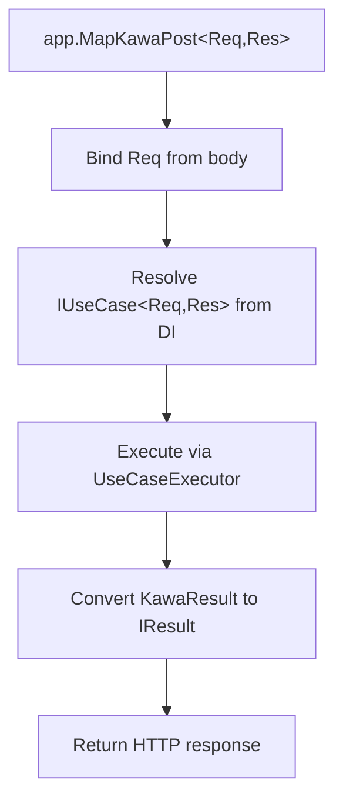

---

## 10. 将来的な拡張構想

Kawa は最初は小さく始めるが、将来的には以下の拡張を想定する。

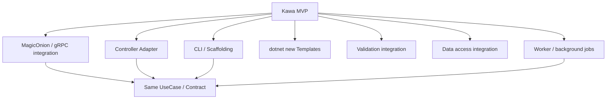

### 10.1 Controller Adapter

既存 ASP.NET Core MVC プロジェクト向けに、Controller から Kawa UseCase を呼び出すための Adapter を提供する。

ただし、Kawa の中心は Minimal API のままとする。

---

### 10.2 MagicOnion / gRPC 統合

MagicOnion や gRPC との統合は、RPC 仕様を中心に据えるのではなく、Transport Adapter として検討する。

同じ UseCase を HTTP API と RPC API の両方へ流せるようにする。

ただし、UseCase を RPC 仕様や proto-first の設計に寄せない。
RPC サービス、message、proto、MagicOnion interface は、既存の UseCase contract を外部に公開するための Adapter として扱う。

Result / Error モデルは HTTP と RPC で統一する。
Transport ごとの差分は、Adapter の変換責務に閉じ込める。

RPC 統合は有力な拡張だが、MVP では急がない。
先に UseCase、Pipeline、Result / Error、規約を安定させる。

---

### 10.3 CLI / Scaffolding

Rails 的な開発体験を目指し、CLI を提供する。

例：

```bash
dotnet kawa new webapp MyApp
dotnet kawa generate usecase CreateUser --lang csharp
dotnet kawa generate usecase CreateUser --lang fsharp
dotnet kawa generate usecase CreateUser --lang vb
dotnet kawa generate endpoint CreateUser --method post --path /users
```

---

### 10.4 Templates

`dotnet new` テンプレートを用意する。

- C# only
- Mixed C# / F#
- Mixed C# / F# / VB.NET
- Experimental CLR language integration
- API only
- Web + Worker
- MagicOnion enabled

---

### 10.5 Validation

Validation は最初から巨大にしない。

将来的に以下を検討する。

- FluentValidation integration
- DataAnnotations integration
- F# validation helper
- Pipeline による validation hook

---

### 10.6 Data Access

Kawa は ORM を強制しない。

ただし、将来的に EF Core 連携を提供する余地を残す。

- Transaction pipeline
- Unit of Work abstraction
- Repository helper
- EF Core integration

ただし、Kawa.Core は EF Core に依存しない。

---

## 11. 設計上の禁止事項

Kawa の初期設計では、以下を避ける。

- ASP.NET Core を置き換えようとしない
- Controller を中心にしない
- Core に HTTP 概念を入れない
- Abstractions に ASP.NET Core 依存を入れない
- F# などの言語固有型を公開 API に漏らしすぎない
- 最初から EF Core や認証を組み込まない
- MediatR に依存しない
- 早すぎるコード生成をしない
- 過剰な抽象化をしない
- 神クラスを作らない
- Framework logic を sample に置かない

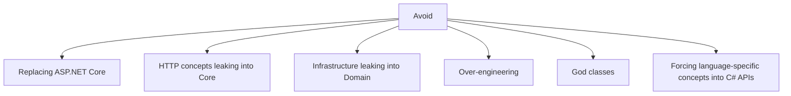

---

## 12. 設計比喩

Kawa は「川」である。

- C# は大河である
- F# は清流である
- VB.NET は歴史ある支流である
- 実験的 CLR 言語は小さな試験水路である
- Contract は水路である
- UseCase は流れである
- Endpoint は水門である
- Pipeline は支流の合流点である
- Result は水質検査である
- Core は河床である

Kawa は城を作らない。  
Kawa は水路を作る。

強く支配するのではなく、自然に流れるようにする。

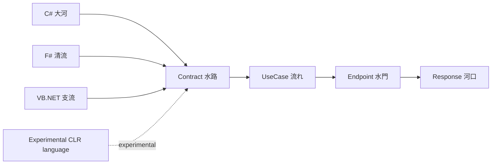

---

## 13. 最初の MVP

最初に実装する範囲は以下。

### Projects

```text
src/
  Kawa.Abstractions/
  Kawa.Core/
  Kawa.Web/
  Kawa.FSharp/

samples/
  Kawa.Sample.CSharp/
  Kawa.Sample.Mixed/

tests/
  Kawa.Abstractions.Tests/
  Kawa.Core.Tests/
  Kawa.Web.Tests/
```

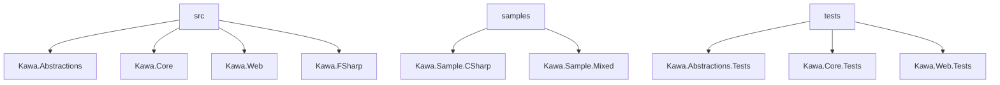

### MVP Features

- `IUseCase<TRequest,TResponse>`
- `KawaResult<T>`
- `KawaError`
- `KawaErrorKind`
- `UseCaseExecutor`
- `MapKawaPost<TRequest,TResponse>`
- Result to HTTP conversion
- C# sample usecase
- F# sample usecase
- Basic tests

### MVP Non-Goals

- EF Core
- Auth
- Controllers
- MagicOnion
- CLI
- Code generation
- Templates
- Full validation framework
- Complex pipeline behaviors

---

## 14. テストカバレッジ方針

Kawa は、テストカバレッジ 100% を設計上の目標とする。

これは、100% という数値だけで品質を保証するという意味ではない。  
未確認の行を意図せず残さず、各責務の振る舞いをテスト可能な形に保つための制約である。

基本方針は次の通り。

- 新規コードは、原則として 100% カバレッジを維持する
- PR の差分も 100% カバレッジを求める
- カバレッジを満たすためだけの空虚なテストを書かない
- 公開 API、UseCase、Result / Error 変換、Endpoint 変換は優先してテストする
- 到達不能コードや環境依存コードが必要な場合は、設計を見直してから例外扱いを検討する
- テストしにくいコードは、責務分割や副作用分離が不足している兆候として扱う

> カバレッジは目的ではない。  
> 設計がテスト可能であることを確認する境界線である。

---

## 15. ビジネスロジックを F# で書く利点

Kawa は C# / F# / VB.NET などの CLR 言語で UseCase / Domain Logic を実装できる。

F# は必須ではない。  
C# だけでも Kawa は利用できる。
すべての主要な機能は、C# だけでも実装できることを保証する。

そのうえで、F# は Domain DSL や複雑な業務ルールに限らず、ドメインモデルとして境界の内側に閉じ込められるなら選択してよい。

しかし、複雑なビジネスルール、状態遷移、条件分岐、権利判定、料金計算、利益分配、入力検証などを扱う場面では、F# はビジネスロジックをより安全で明瞭に表現するための強力な選択肢になる。

### 15.1 業務上の状態を型で明示できる

ビジネスロジックでは、結果が単純な `true / false` では表せないことが多い。

たとえば、利用可否判定には次のような複数の状態があり得る。

- 許可
- 禁止
- ライセンスが必要
- 人間による確認が必要
- 不明

F# では、判別共用体によってこれらを自然に表現できる。

```fsharp
type PermissionDecision =
    | Allowed
    | Denied of reason: string
    | RequiresLicense of licenseUrl: string
    | RequiresReview of reason: string
    | Unknown of reason: string
```

これにより、業務上あり得る状態がコード上に明示される。

```mermaid
flowchart LR
    Decision[PermissionDecision]
    Decision --> Allowed[Allowed]
    Decision --> Denied[Denied<br/>reason required]
    Decision --> License[RequiresLicense<br/>licenseUrl required]
    Decision --> Review[RequiresReview<br/>reason required]
    Decision --> Unknown[Unknown<br/>reason required]
```

---

### 15.2 不正な状態を作りにくい

C# でも `record` や `enum` によって結果を表現できる。

```csharp
public sealed record PermissionResult(
    PermissionStatus Status,
    string? Reason,
    string? LicenseUrl
);
```

しかし、この形では `Status == RequiresLicense` なのに `LicenseUrl == null` という矛盾した状態が作れてしまう。

F# の判別共用体では、`RequiresLicense` に必ず `licenseUrl` を持たせられる。

```fsharp
type PermissionDecision =
    | Allowed
    | Denied of reason: string
    | RequiresLicense of licenseUrl: string
```

このように、F# は「不正な状態を型で表現不能にする」設計を取りやすい。

Kawa において、これは複雑なドメインロジックを安全に扱う上で大きな利点である。

---

### 15.3 パターンマッチが業務ルールと相性がよい

業務ルールには、条件分岐が多い。

- この用途は禁止
- この用途はサブスクリプションがあれば許可
- 商用利用なら追加ライセンスが必要
- 構成素材の一つでも禁止なら全体も禁止
- 不明な用途なら確認が必要

F# のパターンマッチは、こうした条件分岐を読みやすく表現できる。

```fsharp
let evaluate usage policy =
    match policy.GetPermission usage with
    | Some "allowed" ->
        Allowed
    | Some "denied" ->
        Denied $"Usage '{usage}' is denied."
    | Some "requires_license" ->
        RequiresLicense policy.LicenseUrl
    | _ ->
        Unknown $"Usage '{usage}' is not defined."
```

この形は、業務ルールの構造をそのままコードに落とし込みやすい。

---

### 15.4 副作用を分離しやすい

ビジネスロジックには、本来は純粋な判定で済む処理が多い。

しかし実装が肥大化すると、判定処理の中に以下が混ざりやすい。

- DB アクセス
- 外部 API 呼び出し
- ログ出力
- 状態変更
- HTTP の都合
- DI の都合

F# では、純粋関数としてビジネスルールを表現しやすい。

```fsharp
evaluatePolicy : UsageRequest -> ResourcePolicy -> PermissionDecision
```

このように書ける場合、関数は入力を受け取り、判定結果を返すだけである。  
HTTP、DB、外部 API から切り離されるため、テストしやすく、再利用しやすい。

```mermaid
flowchart LR
    Input[UsageRequest + ResourcePolicy] --> Pure[Pure F# business rule]
    Pure --> Output[PermissionDecision]

    DB[(DB)] -.not used.-> Pure
    HTTP[HTTP] -.not used.-> Pure
    External[External API] -.not used.-> Pure
```

---

### 15.5 小さなルールを合成しやすい

Kawa では、個々の責務を小さく閉じ込め、上位で組み合わせることを重視する。

F# は、小さな関数を合成してルールを作るのに向いている。

```fsharp
let denyIfTraining request =
    if request.UsageType = "model_training" then
        Some (Denied "Model training is prohibited.")
    else
        None

let requireLicenseIfCommercial request =
    if request.IsCommercial then
        Some (RequiresLicense request.Policy.LicenseUrl)
    else
        None

let evaluate rules request =
    rules
    |> List.tryPick (fun rule -> rule request)
    |> Option.defaultValue Allowed
```

このように、個別のルールを小さく保ち、最終的な評価処理で合成できる。

```mermaid
flowchart TD
    Request[UsageRequest]
    Rule1[denyIfTraining]
    Rule2[requireLicenseIfCommercial]
    Rule3[other domain rule]
    Eval[evaluate rules]
    Decision[PermissionDecision]

    Request --> Rule1 --> Eval
    Request --> Rule2 --> Eval
    Request --> Rule3 --> Eval
    Eval --> Decision
```

これは Kawa の `Composition over orchestration` と相性がよい。

---

### 15.6 Option / Result によって失敗を明示できる

F# では、値が存在しない可能性を `Option` で表現できる。  
また、成功と失敗を `Result` で表現できる。

これにより、`null` や例外に頼りすぎず、業務上予測可能な失敗を明示しやすくなる。

Kawa では、F# 内部の `Result` / `Option` を、境界で `KawaResult<T>` に変換する。

```mermaid
flowchart LR
    FSharpResult[F# Result / Option]
    Convert[Convert]
    KawaResult[KawaResult&lt;T&gt;]
    Web[Kawa.Web]
    Response[HTTP Response]

    FSharpResult --> Convert --> KawaResult --> Web --> Response
```

これにより、F# 内部では F# らしい表現を使い、外部境界では C# friendly な `KawaResult<T>` に統一できる。

---

### 15.7 テストしやすい

純粋関数として書かれたビジネスルールは、テストが容易である。

DB、HTTP、DI、外部 API を用意しなくても、入力と出力だけを確認できる。

```fsharp
let result = evaluatePolicy request policy

result = Denied "LoRA training is prohibited."
```

これは、ビジネスロジックの信頼性を高める。

Kawa において、F# は以下のような領域で特に有効である。

- 権利ポリシー判定
- 料金計算
- 利益分配
- 状態遷移
- 複数素材の条件合成
- 入力検証ルール
- ワークフロー分岐
- 例外ケースの多いドメインルール

---

### 15.8 C# / F# / VB.NET / 実験的 CLR 言語の役割分担

Kawa は、すべてを F# で書くことを求めない。

C# は、ASP.NET Core、Minimal API、DI、DTO、OpenAPI、EF Core など、アプリケーションを現実の実行環境へ接続する部分に強い。

ただし、Kawa が推奨する言語混在は「1 project に複数言語の source file を入れる」ことではない。
C# / F# / VB.NET は、それぞれ `.csproj` / `.fsproj` / `.vbproj` として project を分け、同じ solution / application の中で合流させる。
境界となる `Contracts` project は C# を推奨し、すべての UseCase project と Transport project がその C# contract を参照する。

F# は、業務ルールそのものを濁らせずに表現する部分に強い。
F# が得意な開発者は、ドメイン境界を越えない限り、より広いドメイン実装を F# で書いてよい。
VB.NET が得意な開発者も、同じ境界を守る限り通常の実装言語として選択してよい。
IronPython などは実験的な選択肢として扱い、Kawa の中核や公開 API をそれらに依存させない。
MRubyCS は Ruby による直接的な UseCase 実装よりも、Rails 互換風の小さな DSL / scripting adapter として扱う。
ただし、外側の契約、公開 API、テンプレート、サンプルは、C# だけでも成立する形を保つ。

```mermaid
flowchart TD
    CSharp[C#]
    FSharp[F#]
    VB[VB.NET]
    Experimental[Experimental CLR language]
    Web[Web / API / DI / Infrastructure]
    Logic[Business Logic / Rules / State transitions]
    Boundary[Kawa Abstractions<br/>C# friendly boundary]

    CSharp --> Web
    FSharp --> Logic
    VB --> Logic
    Experimental -.experimental.-> Logic
    Web --> Boundary
    Logic --> Boundary
```

一文で言えば、

> C# は業務アプリを現実に接続するのに強く、F# は業務ルールそのものを濁らせずに表現するのに強い。

Kawa は、それらの CLR 言語を同じ川に流せるようにするフレームワークである。

---

## 16. 一文要約

Kawa は、ASP.NET Core の上に薄く水路を引き、C# / F# / VB.NET、そして実験的な CLR 言語で書かれた UseCase / Domain Logic を、Minimal API や将来の RPC へ自然に流すための contract-first .NET Web フレームワークである。

Kawa は、支配するフレームワークではない。  
Kawa は、流れを整えるフレームワークである。
