# Kawa Design Principles

## 1. Overview

**Kawa** is a lightweight contract-first / usecase-first .NET web framework built on top of ASP.NET Core.

Its goal is not to replace ASP.NET Core.  
Instead, Kawa uses the strong foundation of ASP.NET Core while organizing common problems in web application development.

Kawa addresses issues such as:

- Business logic leaking into HTTP layers
- Controllers or endpoints becoming places where domain logic accumulates
- Difficulty mixing C#, F#, VB.NET, and other CLR languages in one application
- Reusing application logic across Web API / RPC / Worker / CLI entry points
- Lack of consistency around DTOs, UseCases, validation, results, and error handling
- Lack of conventions that are easy for both humans and AI assistants to read
- The absence of a Rails-like guided development flow in .NET

Kawa aims to be designed like a river.

- Contracts are waterways.
- UseCases are streams.
- Web endpoints are gates.
- Core is the riverbed that keeps the flow clean.
- C#, F#, VB.NET, and other CLR languages are tributaries joining the same water system.

Kawa is not a framework that dominates the application.  
Kawa is a framework that shapes the flow.

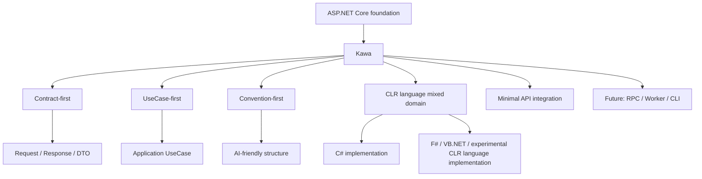

---

## 2. Core Principles

### 2.1 Do not replace ASP.NET Core

Kawa does not reinvent the web server or full-stack foundation.

The following capabilities already provided by ASP.NET Core should be used as they are:

- Hosting
- Dependency Injection
- Configuration
- Logging
- Middleware
- Routing
- Minimal API
- OpenAPI
- Authentication / Authorization
- Extension foundations such as gRPC and SignalR

Kawa provides a thin application framework layer on top of these capabilities.

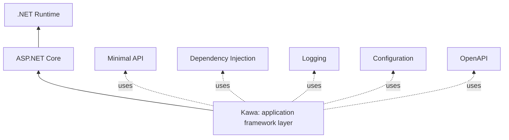

Kawa's role is not to take over ASP.NET Core's responsibilities.  
Its role is to organize the application flow.

---

### 2.2 Contract-first / UseCase-first

Kawa does not place Web endpoints or controllers at the center of application design.

Instead, Kawa places the following three concepts at the center:

- Request
- Response
- UseCase

A UseCase is the smallest unit that completes one business purpose.

Web APIs and RPC APIs are merely entry points that expose UseCases to the outside world.

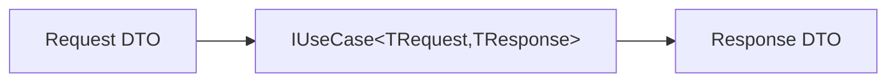

HTTP, RPC, CLI, and Worker processes are different entry points into the same flow.

Therefore:

- A UseCase does not know HTTP.
- A UseCase does not reference ASP.NET Core.
- A UseCase does not depend on controllers or Minimal APIs.
- A UseCase does not depend on RPC service definitions or proto definitions.

Transports are adapters that call UseCases.

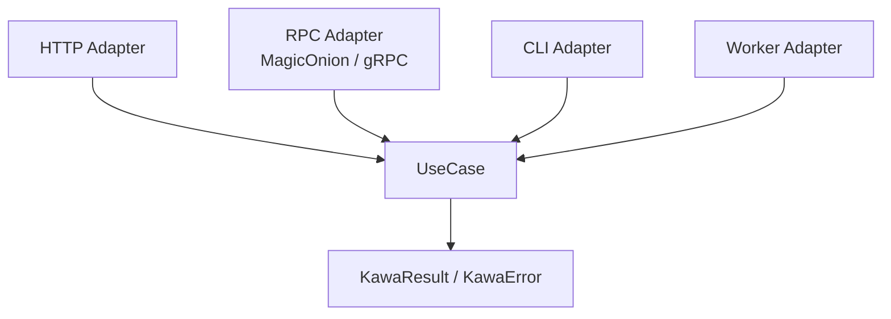

---

### 2.3 Convention-first / AI-friendly

Kawa prefers conventions over configuration.

Conventions should be stable enough for both human developers and AI assistants to read predictably.

In Kawa, AI-friendly does not mean adding special AI features.
It means file names, type names, responsibilities, execution order, error representation, and transport boundaries are predictable.

The basic conventions are:

- Use one file per UseCase as the default unit.
- Align UseCase names, Request names, Response names, Error names, and Test names.
- Keep each UseCase's input, output, failures, dependencies, and execution flow easy to trace from one place.
- Make Validation, Authorization, Transaction, Logging, and Error handling visible as pipelines.
- Treat HTTP, RPC, CLI, and Worker entry points as Transport Adapters that call UseCases.
- Do not let transport-specific concerns shape UseCase design.

These conventions let both developers and AI assistants predict where to look and what they will find.

---

### 2.4 Let CLR languages flow into the same water system

Kawa must be 100% viable with C# only. Every major design must remain natural to implement in C# alone.

On top of that, Kawa values allowing developers who are strong in F#, VB.NET, or other CLR-hosted languages to choose those languages naturally as long as they keep the boundaries intact.

F# is especially suitable for domain models, Domain DSLs, complex business rules, state transitions, validation, rights evaluation, and pricing.
VB.NET can also be a normal implementation target when existing assets or team expertise make it appropriate.
Languages such as IronPython should be treated as experimental implementation targets for now.
[MRubyCS](https://github.com/hadashiA/MRubyCS) should be treated less as a normal CLR language implementation and more as an experimental Rails-like DSL / scripting adapter that runs on MRuby.

However, Kawa should not leak language-specific types or runtime representations directly into C# public APIs.

At the same time, Kawa should not weaken each language's expressiveness merely to satisfy C# conventions.

For this reason, Kawa's boundary types should be C# friendly:

- interface
- record
- enum
- class
- simple DTO

Inside domain boundaries, each language can freely use its own expressive tools:

- discriminated unions
- option
- result
- function composition
- pattern matching
- language-specific domain models

The design principle is:

> Simple on the outside, free on the inside.

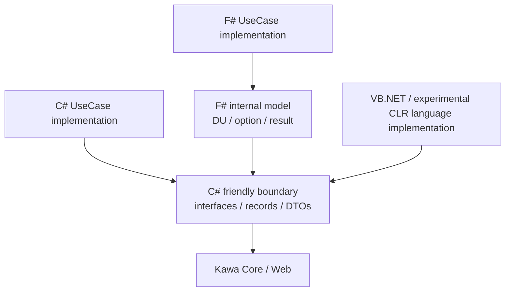

---

### 2.5 Use Minimal API as the main Web foundation

Kawa's Web integration should primarily use ASP.NET Core Minimal APIs.

Minimal APIs are thin, making them a good fit for acting as HTTP gates into UseCases.

Controllers are not the center of Kawa.  
However, Kawa may later provide a Controller Adapter for compatibility and migration from existing ASP.NET Core applications.

The basic policy is:

- Kawa's core Web integration is based on Minimal API.
- Controllers are compatibility layers.
- Web layers must not contain domain logic.
- HTTP is only an entry point into UseCases.

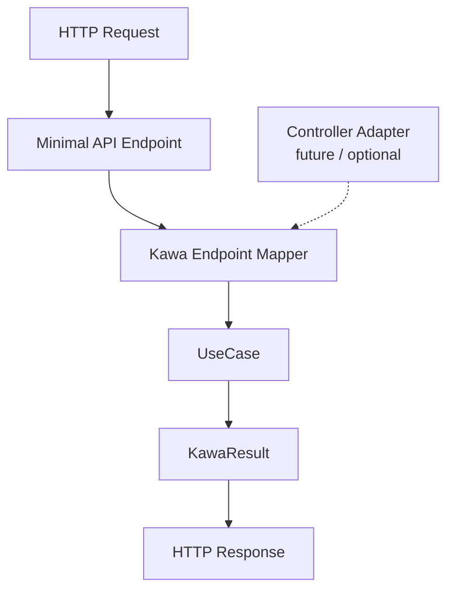

---

### 2.6 Start thin and small

Kawa should not start as a large framework.

The first MVP should only cover:

- UseCase abstraction
- Result / Error model
- UseCaseExecutor
- Mapping to Minimal API
- Resolving UseCases from DI
- HTTP Result conversion
- C# UseCase sample
- F# UseCase sample

The first version should not include:

- EF Core integration
- Authentication / Authorization
- Controller integration
- MagicOnion / gRPC integration
- CLI
- Code generation
- Templates
- Complex validation framework
- MediatR dependency

Kawa should start not as a great canal, but as a small spring.

---

## 3. Layer Structure

Kawa's basic layer structure is as follows.

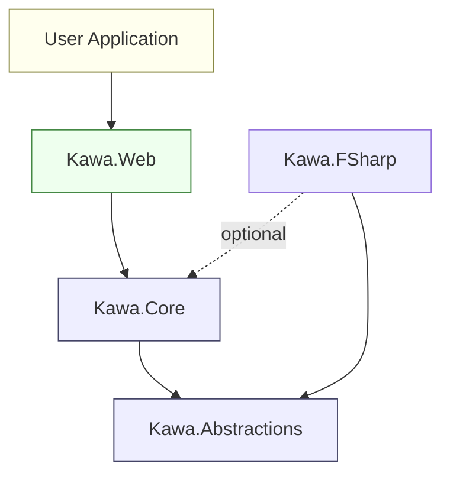

Dependencies flow in one direction.  
Lower layers must not know higher layers.

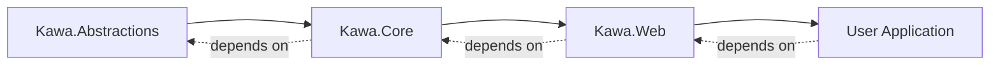

---

### 3.1 Kawa.Abstractions

#### Purpose

Defines the minimal public contracts shared across Kawa.

This layer should be the most stable layer, and it must not contain ASP.NET Core or Web concepts.

#### Contains

- `IUseCase<TRequest, TResponse>`
- `KawaResult<T>`
- `KawaError`
- `KawaErrorKind`
- Minimal shared DTOs / interfaces

#### Dependency rules

- Must not depend on ASP.NET Core
- Must not depend on Kawa.Web
- Must not depend on EF Core
- Must not depend on infrastructure
- Must not expose F# or other language-specific types in public APIs

---

### 3.2 Kawa.Core

#### Purpose

Provides Kawa's HTTP-independent core behavior.

This layer handles UseCase execution, pipelines, and result processing.

#### Contains

- `UseCaseExecutor`
- Pipeline composition
- Result utilities
- Abstract validation hooks
- Common error handling

#### Dependency rules

- May depend on Kawa.Abstractions
- Must not depend on ASP.NET Core
- Must not depend on Kawa.Web
- Must not depend on infrastructure

---

### 3.3 Kawa.Web

#### Purpose

Connects ASP.NET Core Minimal API with Kawa Core.

This layer passes HTTP requests into UseCases and converts UseCase results into HTTP responses.

#### Contains

- `MapKawaPost<TRequest, TResponse>`
- Future extensions such as `MapKawaGet<...>`
- Conversion from `KawaResult<T>` to `IResult`
- `AddKawa()` dependency injection registration
- OpenAPI metadata hooks
- Contract-first OpenAPI document generation
- Default Swagger UI / ReDoc setup
- Minimal API endpoint registration

#### Dependency rules

- May depend on ASP.NET Core
- May depend on Kawa.Abstractions
- May depend on Kawa.Core
- Must not contain domain logic

---

### 3.3.1 OpenAPI / Swagger / ReDoc integration

Kawa.Web treats OpenAPI as contract-first.

The source of an OpenAPI document is not the endpoint implementation. It is Kawa's `Request` / `Response` contracts.
Mapping APIs such as `MapKawaPost<TUseCase>` infer request schemas, response schemas, and error schemas from the `IUseCase<TRequest,TResponse>` contract implemented by the UseCase, then attach that information as Minimal API OpenAPI metadata.

When Kawa.Web is set up, developers should be able to inspect the API contract without extra ceremony.

Default policy:

- `AddKawa()` registers Kawa's OpenAPI metadata provider
- `AddKawaWeb()` or a future Web setup API registers ASP.NET Core OpenAPI services
- `MapKawaPost<TUseCase>` reflects `TRequest` / `TResponse` into the OpenAPI schema
- Swagger UI and ReDoc are mapped by the application in development
- UI exposure in production is explicit opt-in
- `/openapi/{documentName}.json` is the default OpenAPI document path candidate
- `/swagger` and `/redoc` are the default UI path candidates

OpenAPI responsibility split:

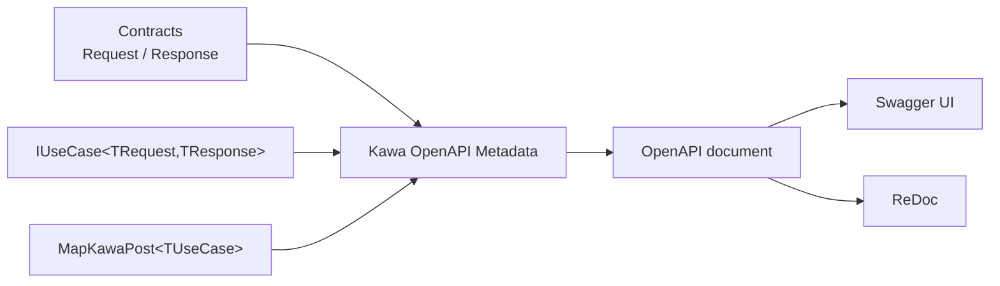

Endpoints describe routes and transport binding, but they are not the center of the API schema.
The API schema starts from Contracts; Endpoints declare which URL / method exposes those Contracts.

Therefore, creating separate DTOs such as `CreateUserHttpRequest` or `CreateUserSwaggerDto` solely for OpenAPI should be avoided by default.
When a transport-specific input shape is necessary, it should still be converted into Kawa `Request` / `Response` contracts so the OpenAPI contract remains centered on Kawa contracts.

---

### 3.4 Kawa.FSharp

#### Purpose

Makes it pleasant to write Kawa UseCases and domain logic in F#.

F# support is optional and must not be forced into Kawa's core.

#### Contains

- Helpers for implementing `IUseCase<TRequest,TResponse>` from F#
- Converters between F# `Result` / `Option` and `KawaResult<T>`
- F# friendly helpers
- F# sample support

#### Dependency rules

- May depend on Kawa.Abstractions
- May depend on Kawa.Core if necessary
- Should generally not depend on Kawa.Web
- Must not leak F#-specific concepts into Kawa.Abstractions
- Other CLR language support must also keep language-specific concepts out of Kawa.Abstractions

---

## 4. Basic Processing Flow

Kawa's basic processing flow is as follows.

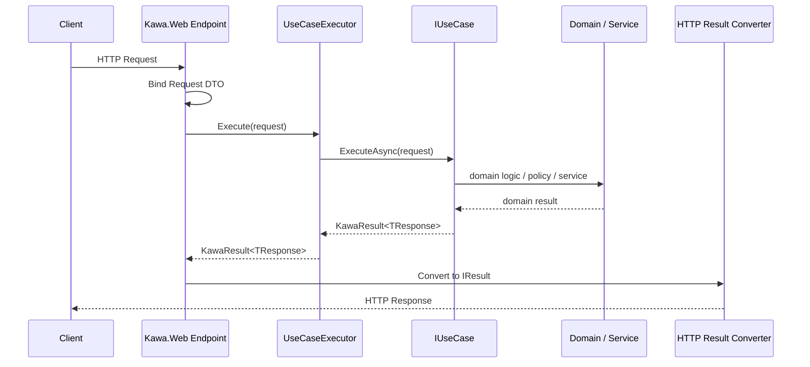

This separates the HTTP layer from the UseCase layer.

A UseCase does not need to know that it is being called from HTTP.

---

## 5. One-way Flow Principle

Kawa keeps processing flow one-way by default.

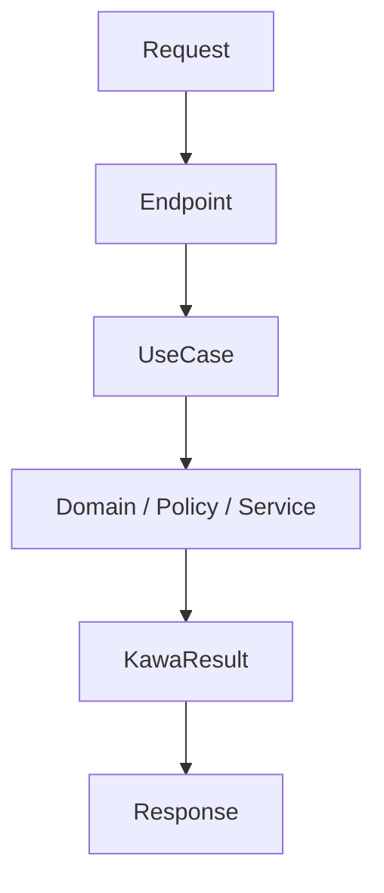

Lower layers do not know higher layers.  
Domain does not know Web.  
Core does not know ASP.NET Core.  
UseCases do not know HTTP.

This does not mean that values never return upward.  
It means that **dependency direction and responsibility knowledge do not flow backward**.

> A river does not flow backward.

---

## 6. Composition over orchestration

Kawa encapsulates individual responsibilities in small classes or functions.  
However, it should not hide the overall business flow too much.

- Small responsibilities are encapsulated in lower-level classes or functions.
- UseCases explicitly compose those pieces.
- DI is used for dependency resolution.
- Business order and decision logic should not be buried inside DI configuration.
- Abstraction should be introduced only where replaceability is actually needed.

Source files should follow the same discipline.

- One UseCase should be complete in one source file by default.
- One source file should serve one clear responsibility.
- File names should state that responsibility and usually match the primary type or module they contain.
- A UseCase file should gather the information needed to understand that UseCase's input, output, main failures, and execution flow.
- Contracts, results, errors, UseCases, endpoints, and tests should be split when combining them would blur ownership or purpose.
- A source file may contain closely scoped supporting code only when separating it would make the responsibility less clear.

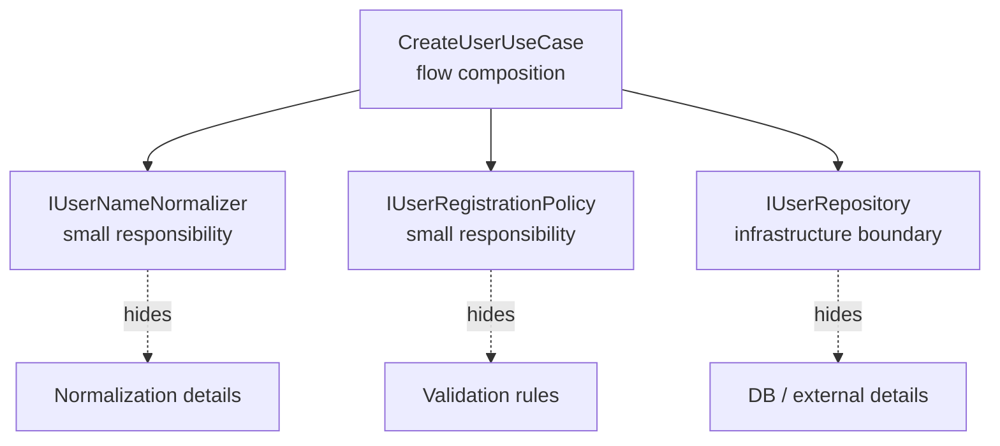

Design motto:

> Hide individual responsibilities.  
> Do not over-hide the flow.

---

## 7. Result / Error Model

Kawa should not overuse exceptions.

Predictable business failures should be represented with `KawaResult<T>` and `KawaError`.

Examples:

- Validation error
- Not found
- Unauthorized
- Forbidden
- Conflict
- Domain rule violation
- Unknown error

Basic HTTP conversion rules are:

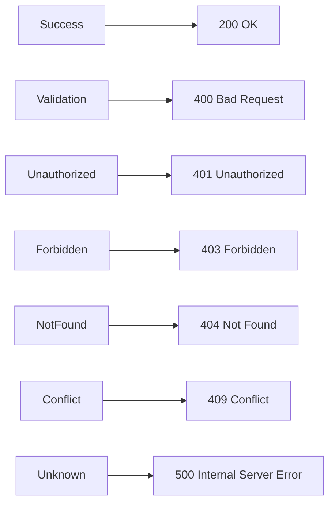

This conversion is handled by Kawa.Web.  
Kawa.Core does not know HTTP status codes.

---

## 8. CLR Language Mixed Usage Policy

### 8.1 Keep boundaries C# friendly

Public APIs should be natural to use from C#.

```csharp
public interface IUseCase<TRequest, TResponse>
{
    ValueTask<KawaResult<TResponse>> ExecuteAsync(
        TRequest request,
        CancellationToken cancellationToken);
}
```

This allows the same interface to be implemented from C#, F#, VB.NET, and other CLR languages.

In Kawa, the unit of language mixing is the project / assembly, not the source file.

In practical .NET terms, one project usually means one language compiler. Kawa should not make mixing C#, F#, and VB.NET source files inside one `.csproj`, `.fsproj`, or `.vbproj` the standard convention.
Instead, one solution / application may contain separate C#, F#, and VB.NET projects that all reference the same C# friendly contract boundary.

The recommended structure is:

```text
MyApp.Contracts        # C#. Request / Response / Error contracts
MyApp.UseCases.CSharp  # C# UseCase implementation
MyApp.UseCases.FSharp  # F# UseCases / domain rules
MyApp.UseCases.VB      # VB.NET UseCase implementation
MyApp.Web              # ASP.NET Core / Kawa.Web endpoints
MyApp.Cli              # optional CLI adapter
MyApp.Worker           # optional Worker adapter
```

Dependencies should stay contract-first.

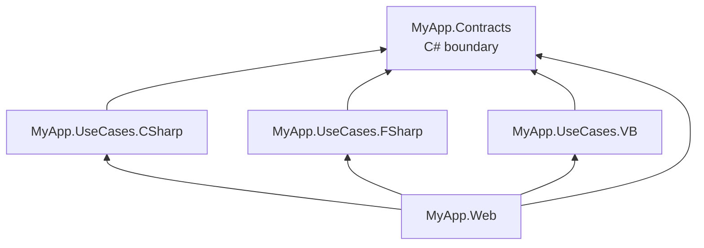

With this structure, Web / RPC / CLI / Worker adapters do not need to know which language implements a UseCase. They only see `IUseCase<TRequest,TResponse>` and Kawa `Request` / `Response` contracts.

---

### 8.2 Let F# shine in internal representation

F# implementations may freely use discriminated unions, option, result, and function composition internally.

F# may be chosen more broadly than just Domain DSLs or complex business rules, as long as it remains contained inside domain-model boundaries.
The important constraint is not whether F# is used, but whether F#-specific representations stay out of Kawa's public boundaries.

UseCases and adapters that are already clear in C# do not need to be pushed toward F#.
At the same time, developers who are productive in F# should not be blocked from choosing it inside domain boundaries.

However, before crossing Web or public boundaries, F# internal models should be converted into C# friendly DTOs or `KawaResult<T>`.

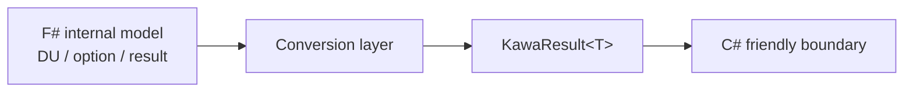

---

### 8.3 Support other CLR languages inside boundaries

The same policy applies to CLR languages beyond F#.

VB.NET may be treated as a normal .NET implementation language, just like C# and F#.
When a UseCase or domain model is written in VB.NET, its boundary should still be expressed through C# friendly interfaces, records, classes, DTOs, and `KawaResult<T>`.

Languages such as IronPython should be treated as experimental implementation targets for now.
Domain logic written in those languages must still be converted to C# friendly contracts before it reaches Kawa's public boundary.

When Kawa supports [MRubyCS](https://github.com/hadashiA/MRubyCS), the primary goal should not be implementing Kawa UseCases directly in Ruby.
Instead, Kawa should expose a small Rails-compatible-style method surface that can run within MRuby's limits.
This is not full Rails compatibility; it is a minimal DSL aligned with Kawa's contract-first / usecase-first model.

An MRubyCS adapter may expose vocabulary such as:

- `params`
- `permit`
- `validate`
- `before_action`
- `render`
- `redirect_to`
- `ok`
- `created`
- `not_found`
- `unprocessable_entity`
- `usecase`

These methods should not pull ASP.NET Core or Kawa's public APIs toward Ruby.
They are a thin adapter that gives Ruby code a Rails-like feel while converting back to C# friendly DTOs, `KawaResult<T>`, and HTTP results at the boundary.

Experimental CLR language support does not guarantee:

- Standard templates
- Complete samples
- Stable NuGet package APIs
- The same maintenance priority as C#, F#, or VB.NET
- Full Rails API compatibility

However, as long as the boundary is respected, Kawa's design should not exclude those languages.

---

### 8.4 Do not force a language choice

Kawa enables multiple CLR languages, but does not require any specific one.

Kawa can be used with C# only.  
F# can be introduced partially.  
VB.NET can be introduced.
IronPython, MRubyCS, and similar languages can be introduced experimentally.
Domain models and use cases can be implemented in F#.
Complex rules or domain logic can be extracted into F# where useful.
In every case, the same behavior should remain possible to express in C# alone.
Templates and code generation should make non-C# language usage an explicit choice.

---

## 9. Minimal API Policy

Kawa's first Web API integration uses Minimal API.

Example:

```csharp
builder.Services.AddKawa();
app.MapKawaPost<CreateUserRequest, CreateUserResponse>("/users");
```

Kawa.Web should perform the following steps:

1. Bind `CreateUserRequest` from the HTTP request
2. Resolve `IUseCase<CreateUserRequest, CreateUserResponse>` from DI
3. Execute it through `UseCaseExecutor`
4. Convert `KawaResult<CreateUserResponse>` into an HTTP response

The first HTTP contract is intentionally small:

- `AddKawa()` registers the core Kawa services used by Kawa endpoints.
- `MapKawaPost<TRequest, TResponse>` binds `TRequest` from the POST request body.
- The mapped endpoint resolves `IUseCase<TRequest, TResponse>` and `UseCaseExecutor` from DI.
- A successful `KawaResult<TResponse>` becomes `200 OK` with its value as the response body.
- A failed `KawaResult<TResponse>` follows the status-code mapping in the Result / Error Model.

This first contract does not yet define GET mapping, route or query binding, OpenAPI metadata, validation hooks, or a general response-shaping API.

Users should not write business logic inside endpoints.

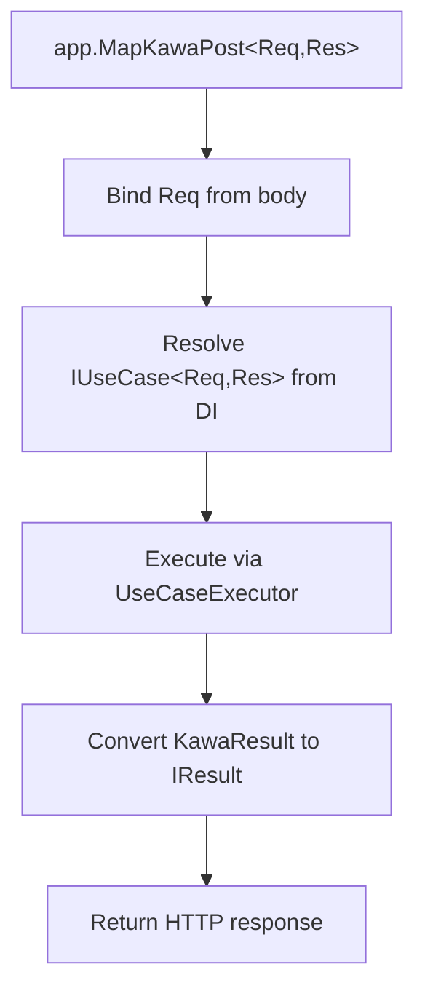

---

## 10. Future Extensions

Kawa starts small, but may later support the following extensions.

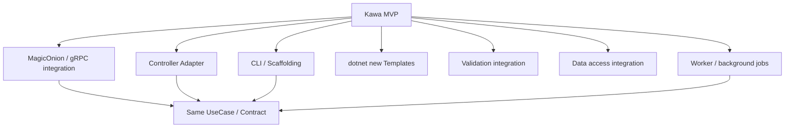

### 10.1 Controller Adapter

Provide an adapter for existing ASP.NET Core MVC projects to call Kawa UseCases from controllers.

However, Minimal API remains the center of Kawa.

---

### 10.2 MagicOnion / gRPC integration

Consider MagicOnion and gRPC integration as Transport Adapters, not as the center of the application design.

The same UseCase should be able to flow into both HTTP APIs and RPC APIs.

However, UseCases should not be shaped around RPC specifications or proto-first design.
RPC services, messages, proto definitions, and MagicOnion interfaces are adapters that expose existing UseCase contracts to the outside world.

The Result / Error model should remain unified across HTTP and RPC.
Transport differences belong inside adapter conversion logic.

RPC integration is a strong future extension, but it should not be rushed into the MVP.
UseCases, pipelines, Result / Error handling, and conventions should stabilize first.

---

### 10.3 CLI / Scaffolding

Provide a CLI for a Rails-like development experience.

Example:

```bash
dotnet kawa new webapp MyApp
dotnet kawa generate usecase CreateUser --lang csharp
dotnet kawa generate usecase CreateUser --lang fsharp
dotnet kawa generate usecase CreateUser --lang vb
dotnet kawa generate endpoint CreateUser --method post --path /users
```

---

### 10.4 Templates

Provide `dotnet new` templates.

- C# only
- Mixed C# / F#
- Mixed C# / F# / VB.NET
- Experimental CLR language integration
- API only
- Web + Worker
- MagicOnion enabled

---

### 10.5 Validation

Validation should not start as a large framework.

Future options include:

- FluentValidation integration
- DataAnnotations integration
- F# validation helpers
- Validation hooks through pipelines

---

### 10.6 Data Access

Kawa does not force any ORM.

However, Kawa may later provide EF Core integration.

- Transaction pipeline
- Unit of Work abstraction
- Repository helper
- EF Core integration

Kawa.Core must not depend on EF Core.

---

## 11. Design Non-goals and Restrictions

The initial design of Kawa should avoid:

- Replacing ASP.NET Core
- Making controllers the center
- Introducing HTTP concepts into Core
- Adding ASP.NET Core dependencies to Abstractions
- Leaking F# or other language-specific types into public APIs
- Adding EF Core or authentication from the beginning
- Depending on MediatR
- Introducing code generation too early
- Over-engineering
- Creating god classes
- Placing framework logic in samples

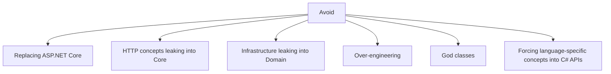

---

## 12. Design Metaphor

Kawa is a river.

- C# is the great river.
- F# is a clear stream.
- VB.NET is an old tributary.
- Experimental CLR languages are small test waterways.
- Contracts are waterways.
- UseCases are flows.
- Endpoints are gates.
- Pipelines are tributary junctions.
- Results are water quality checks.
- Core is the riverbed.

Kawa does not build a castle.  
Kawa builds waterways.

It does not dominate by force.  
It lets applications flow naturally.

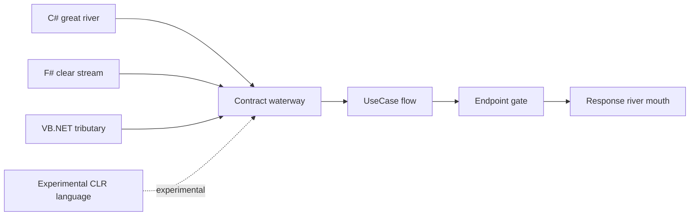

---

## 13. First MVP

The first implementation scope is as follows.

### Projects

```text
src/
  Kawa.Abstractions/
  Kawa.Core/
  Kawa.Web/
  Kawa.FSharp/

samples/
  Kawa.Sample.CSharp/
  Kawa.Sample.Mixed/

tests/
  Kawa.Abstractions.Tests/
  Kawa.Core.Tests/
  Kawa.Web.Tests/
```

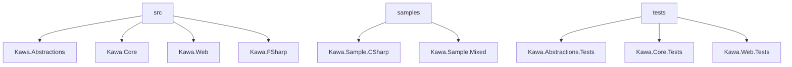

### MVP Features

- `IUseCase<TRequest,TResponse>`
- `KawaResult<T>`
- `KawaError`
- `KawaErrorKind`
- `UseCaseExecutor`
- `MapKawaPost<TRequest,TResponse>`
- Result to HTTP conversion
- C# sample UseCase
- F# sample UseCase
- Basic tests

### MVP Non-goals

- EF Core
- Auth
- Controllers
- MagicOnion
- CLI
- Code generation
- Templates
- Full validation framework
- Complex pipeline behaviors

---

## 14. Test Coverage Policy

Kawa treats 100% test coverage as a design goal.

This does not mean that the number alone guarantees quality.  
It is a constraint for avoiding unintentionally unverified lines and keeping each responsibility testable.

Basic policy:

- New code should maintain 100% coverage by default.
- PR patches should also require 100% coverage.
- Do not write hollow tests only to satisfy coverage.
- Public APIs, UseCases, Result / Error conversion, and Endpoint conversion should be tested first.
- If unreachable code or environment-dependent code is necessary, reconsider the design before treating it as an exception.
- Code that is hard to test should be treated as a sign that responsibility splitting or side-effect isolation is insufficient.

> Coverage is not the goal.  
> It is the boundary that verifies the design remains testable.

---

## 15. Advantages of Writing Business Logic in F#

Kawa allows UseCases and domain logic to be implemented in C#, F#, VB.NET, and other CLR languages.

F# is not required.  
Kawa can be used entirely with C#.
Every major feature should remain implementable in C# alone.

On top of that, F# may be chosen not only for Domain DSLs or complex business rules, but anywhere it can remain contained as a domain model behind Kawa's C# friendly boundaries.

However, when dealing with complex business rules, state transitions, conditional branching, rights evaluation, pricing, revenue sharing, and validation, F# can be a powerful choice for expressing business logic more safely and clearly.

### 15.1 Business states can be made explicit with types

Business logic often cannot be represented by simple `true / false`.

For example, permission evaluation may result in:

- Allowed
- Denied
- Requires license
- Requires human review
- Unknown

F# can represent these states naturally with discriminated unions.

```fsharp
type PermissionDecision =
    | Allowed
    | Denied of reason: string
    | RequiresLicense of licenseUrl: string
    | RequiresReview of reason: string
    | Unknown of reason: string
```

This makes possible business states explicit in code.

```mermaid
flowchart LR
    Decision[PermissionDecision]
    Decision --> Allowed[Allowed]
    Decision --> Denied[Denied<br/>reason required]
    Decision --> License[RequiresLicense<br/>licenseUrl required]
    Decision --> Review[RequiresReview<br/>reason required]
    Decision --> Unknown[Unknown<br/>reason required]
```

---

### 15.2 Invalid states are harder to create

C# can represent results with `record` and `enum`.

```csharp
public sealed record PermissionResult(
    PermissionStatus Status,
    string? Reason,
    string? LicenseUrl
);
```

However, this shape allows invalid combinations, such as `Status == RequiresLicense` while `LicenseUrl == null`.

With an F# discriminated union, `RequiresLicense` can require `licenseUrl`.

```fsharp
type PermissionDecision =
    | Allowed
    | Denied of reason: string
    | RequiresLicense of licenseUrl: string
```

In this way, F# makes it easier to make invalid states unrepresentable.

For Kawa, this is a major advantage when handling complex domain logic.

---

### 15.3 Pattern matching fits business rules well

Business rules often involve many branches:

- This usage is denied
- This usage is allowed if the user has a subscription
- Commercial use requires an additional license
- If one component asset denies a use, the composite also denies it
- Unknown usage requires review

F# pattern matching can express this kind of branching clearly.

```fsharp
let evaluate usage policy =
    match policy.GetPermission usage with
    | Some "allowed" ->
        Allowed
    | Some "denied" ->
        Denied $"Usage '{usage}' is denied."
    | Some "requires_license" ->
        RequiresLicense policy.LicenseUrl
    | _ ->
        Unknown $"Usage '{usage}' is not defined."
```

This makes it easy to map business rule structure directly into code.

---

### 15.4 Side effects are easier to separate

Many business rules can be written as pure evaluation.

However, as implementations grow, rule evaluation can easily become mixed with:

- DB access
- External API calls
- Logging
- State mutation
- HTTP concerns
- DI concerns

F# makes it natural to express business rules as pure functions.

```fsharp
evaluatePolicy : UsageRequest -> ResourcePolicy -> PermissionDecision
```

Such a function only receives input and returns a decision.  
It is separated from HTTP, DB, and external APIs, making it easier to test and reuse.

```mermaid
flowchart LR
    Input[UsageRequest + ResourcePolicy] --> Pure[Pure F# business rule]
    Pure --> Output[PermissionDecision]

    DB[(DB)] -.not used.-> Pure
    HTTP[HTTP] -.not used.-> Pure
    External[External API] -.not used.-> Pure
```

---

### 15.5 Small rules are easy to compose

Kawa values small responsibilities composed at a higher level.

F# is well suited for composing small functions into rules.

```fsharp
let denyIfTraining request =
    if request.UsageType = "model_training" then
        Some (Denied "Model training is prohibited.")
    else
        None

let requireLicenseIfCommercial request =
    if request.IsCommercial then
        Some (RequiresLicense request.Policy.LicenseUrl)
    else
        None

let evaluate rules request =
    rules
    |> List.tryPick (fun rule -> rule request)
    |> Option.defaultValue Allowed
```

Individual rules stay small, and final evaluation composes them.

```mermaid
flowchart TD
    Request[UsageRequest]
    Rule1[denyIfTraining]
    Rule2[requireLicenseIfCommercial]
    Rule3[other domain rule]
    Eval[evaluate rules]
    Decision[PermissionDecision]

    Request --> Rule1 --> Eval
    Request --> Rule2 --> Eval
    Request --> Rule3 --> Eval
    Eval --> Decision
```

This fits Kawa's `Composition over orchestration` principle.

---

### 15.6 Option / Result make failures explicit

In F#, absence can be represented with `Option`.  
Success and failure can be represented with `Result`.

This reduces overreliance on `null` and exceptions for predictable business failures.

Inside Kawa, F# internal `Result` / `Option` values can be converted into `KawaResult<T>` at the boundary.

```mermaid
flowchart LR
    FSharpResult[F# Result / Option]
    Convert[Convert]
    KawaResult[KawaResult&lt;T&gt;]
    Web[Kawa.Web]
    Response[HTTP Response]

    FSharpResult --> Convert --> KawaResult --> Web --> Response
```

This allows F# implementations to remain idiomatic internally while exposing a unified C# friendly `KawaResult<T>` externally.

---

### 15.7 Testing becomes easier

Business rules written as pure functions are easy to test.

Tests can verify input and output without preparing DB, HTTP, DI, or external APIs.

```fsharp
let result = evaluatePolicy request policy

result = Denied "LoRA training is prohibited."
```

This improves confidence in business logic.

F# is especially useful in Kawa for:

- Rights policy evaluation
- Pricing calculation
- Revenue sharing
- State transitions
- Composite condition merging
- Input validation rules
- Workflow branching
- Domain rules with many exceptional cases

---

### 15.8 Division of responsibilities between C#, F#, VB.NET, and experimental CLR languages

Kawa does not require everything to be written in F#.

C# is strong at connecting applications to the real runtime environment: ASP.NET Core, Minimal API, DI, DTOs, OpenAPI, EF Core, and infrastructure.

However, Kawa's recommended language mixing model is not putting multiple languages' source files into one project.
C#, F#, and VB.NET should live in separate `.csproj`, `.fsproj`, and `.vbproj` projects, then join in the same solution / application.
The boundary `Contracts` project should preferably be C#, and every UseCase project and Transport project should reference those C# contracts.

F# is strong at expressing business rules themselves without muddying the logic.
Developers who are productive in F# may write broader domain implementations in F#, as long as those implementations do not cross domain boundaries.
Developers who are productive in VB.NET may also choose it as a normal implementation language when the same boundaries are respected.
IronPython and similar languages are experimental choices and must not become dependencies of Kawa's core or public APIs.
MRubyCS should be treated as a Rails-compatible-style DSL / scripting adapter rather than as the primary way to implement UseCases directly in Ruby.
However, external contracts, public APIs, templates, and samples should remain viable with C# alone.

```mermaid
flowchart TD
    CSharp[C#]
    FSharp[F#]
    VB[VB.NET]
    Experimental[Experimental CLR language]
    Web[Web / API / DI / Infrastructure]
    Logic[Business Logic / Rules / State transitions]
    Boundary[Kawa Abstractions<br/>C# friendly boundary]

    CSharp --> Web
    FSharp --> Logic
    VB --> Logic
    Experimental -.experimental.-> Logic
    Web --> Boundary
    Logic --> Boundary
```

In one sentence:

> C# is strong at connecting business applications to reality, while F# is strong at expressing business rules without muddying them.

Kawa is a framework that lets those CLR languages flow into the same river.

---

## 16. One-sentence Summary

Kawa is a contract-first .NET web framework that lays a thin waterway on top of ASP.NET Core and lets UseCases / Domain Logic written in C#, F#, VB.NET, and experimental CLR languages flow naturally into Minimal APIs and future RPC entry points.

Kawa is not a framework that dominates.  
Kawa is a framework that shapes the flow.
