# Kawa Design Principles

## 1. Overview

**Kawa** is a lightweight contract-first / usecase-first .NET web framework built on top of ASP.NET Core.

Its goal is not to replace ASP.NET Core.  
Instead, Kawa uses the strong foundation of ASP.NET Core while organizing common problems in web application development.

Kawa addresses issues such as:

- Business logic leaking into HTTP layers
- Controllers or endpoints becoming places where domain logic accumulates
- Difficulty mixing C# and F# in one application
- Reusing application logic across Web API / RPC / Worker / CLI entry points
- Lack of consistency around DTOs, UseCases, validation, results, and error handling
- The absence of a Rails-like guided development flow in .NET

Kawa aims to be designed like a river.

- Contracts are waterways.
- UseCases are streams.
- Web endpoints are gates.
- Core is the riverbed that keeps the flow clean.
- C# and F# are tributaries joining the same water system.

Kawa is not a framework that dominates the application.  
Kawa is a framework that shapes the flow.

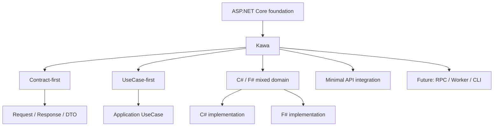

---

## 2. Core Principles

### 2.1 Do not replace ASP.NET Core

Kawa does not reinvent the web server or full-stack foundation.

The following capabilities already provided by ASP.NET Core should be used as they are:

- Hosting
- Dependency Injection
- Configuration
- Logging
- Middleware
- Routing
- Minimal API
- OpenAPI
- Authentication / Authorization
- Extension foundations such as gRPC and SignalR

Kawa provides a thin application framework layer on top of these capabilities.

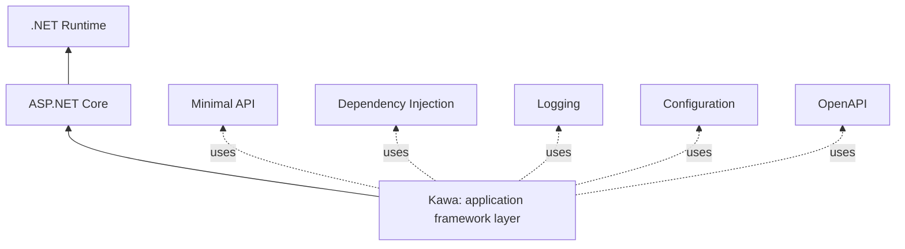

Kawa's role is not to take over ASP.NET Core's responsibilities.  
Its role is to organize the application flow.

---

### 2.2 Contract-first / UseCase-first

Kawa does not place Web endpoints or controllers at the center of application design.

Instead, Kawa places the following three concepts at the center:

- Request
- Response
- UseCase

A Web API is merely an entry point that exposes a UseCase to the outside world.

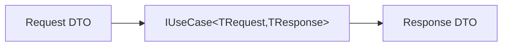

HTTP, RPC, CLI, and Worker processes are different entry points into the same flow.

Therefore:

- A UseCase does not know HTTP.
- A UseCase does not reference ASP.NET Core.
- A UseCase does not depend on controllers or Minimal APIs.

---

### 2.3 Let C# and F# flow into the same water system

Kawa values the ability to write domain models and use cases in both C# and F#.

However, Kawa should not leak F#-specific types directly into C# public APIs.  
At the same time, Kawa should not weaken F#'s expressiveness just to satisfy C# conventions.

For this reason, Kawa's boundary types should be C# friendly:

- interface
- record
- enum
- class
- simple DTO

Inside implementations, F# can freely use its own expressive tools:

- discriminated unions
- option
- result
- function composition
- pattern matching

The design principle is:

> Simple on the outside, free on the inside.

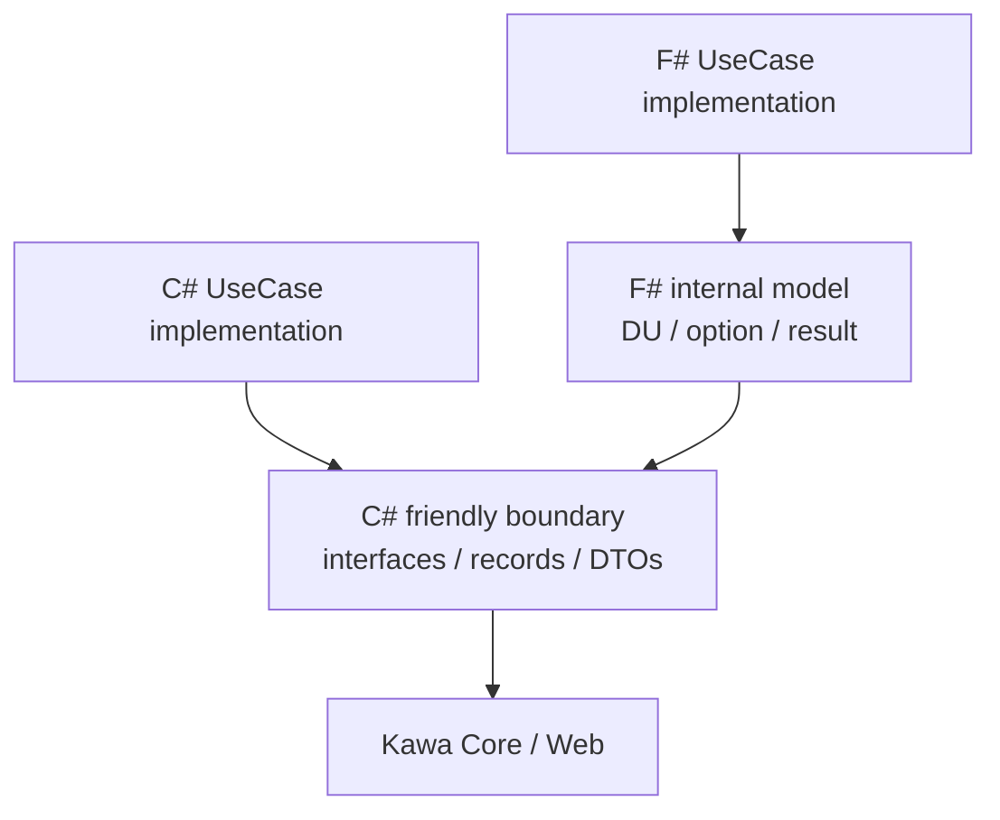

---

### 2.4 Use Minimal API as the main Web foundation

Kawa's Web integration should primarily use ASP.NET Core Minimal APIs.

Minimal APIs are thin, making them a good fit for acting as HTTP gates into UseCases.

Controllers are not the center of Kawa.  
However, Kawa may later provide a Controller Adapter for compatibility and migration from existing ASP.NET Core applications.

The basic policy is:

- Kawa's core Web integration is based on Minimal API.
- Controllers are compatibility layers.
- Web layers must not contain domain logic.
- HTTP is only an entry point into UseCases.

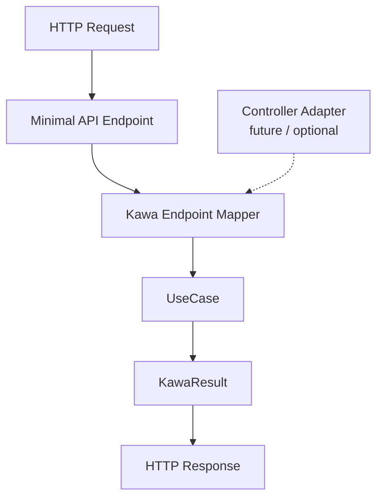

---

### 2.5 Start thin and small

Kawa should not start as a large framework.

The first MVP should only cover:

- UseCase abstraction
- Result / Error model
- UseCaseExecutor
- Mapping to Minimal API
- Resolving UseCases from DI
- HTTP Result conversion
- C# UseCase sample
- F# UseCase sample

The first version should not include:

- EF Core integration
- Authentication / Authorization
- Controller integration
- MagicOnion / gRPC integration
- CLI
- Code generation
- Templates
- Complex validation framework
- MediatR dependency

Kawa should start not as a great canal, but as a small spring.

---

## 3. Layer Structure

Kawa's basic layer structure is as follows.

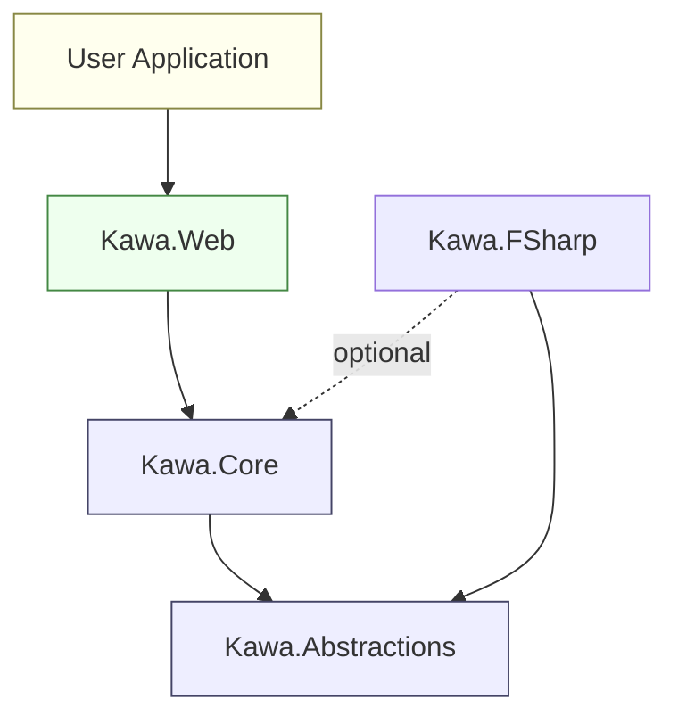

Dependencies flow in one direction.  
Lower layers must not know higher layers.

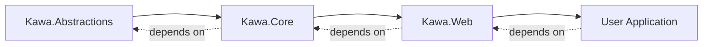

---

### 3.1 Kawa.Abstractions

#### Purpose

Defines the minimal public contracts shared across Kawa.

This layer should be the most stable layer, and it must not contain ASP.NET Core or Web concepts.

#### Contains

- `IUseCase<TRequest, TResponse>`
- `KawaResult<T>`
- `KawaError`
- `KawaErrorKind`
- Minimal shared DTOs / interfaces

#### Dependency rules

- Must not depend on ASP.NET Core
- Must not depend on Kawa.Web
- Must not depend on EF Core
- Must not depend on infrastructure
- Must not expose F#-specific types in public APIs

---

### 3.2 Kawa.Core

#### Purpose

Provides Kawa's HTTP-independent core behavior.

This layer handles UseCase execution, pipelines, and result processing.

#### Contains

- `UseCaseExecutor`
- Pipeline composition
- Result utilities
- Abstract validation hooks
- Common error handling

#### Dependency rules

- May depend on Kawa.Abstractions
- Must not depend on ASP.NET Core
- Must not depend on Kawa.Web
- Must not depend on infrastructure

---

### 3.3 Kawa.Web

#### Purpose

Connects ASP.NET Core Minimal API with Kawa Core.

This layer passes HTTP requests into UseCases and converts UseCase results into HTTP responses.

#### Contains

- `MapKawaPost<TRequest, TResponse>`
- Future extensions such as `MapKawaGet<...>`
- Conversion from `KawaResult<T>` to `IResult`
- OpenAPI metadata hooks
- Minimal API endpoint registration

#### Dependency rules

- May depend on ASP.NET Core
- May depend on Kawa.Abstractions
- May depend on Kawa.Core
- Must not contain domain logic

---

### 3.4 Kawa.FSharp

#### Purpose

Makes it pleasant to write Kawa UseCases and domain logic in F#.

F# support is optional and must not be forced into Kawa's core.

#### Contains

- Helpers for implementing `IUseCase<TRequest,TResponse>` from F#
- Converters between F# `Result` / `Option` and `KawaResult<T>`
- F# friendly helpers
- F# sample support

#### Dependency rules

- May depend on Kawa.Abstractions
- May depend on Kawa.Core if necessary
- Should generally not depend on Kawa.Web
- Must not leak F#-specific concepts into Kawa.Abstractions

---

## 4. Basic Processing Flow

Kawa's basic processing flow is as follows.

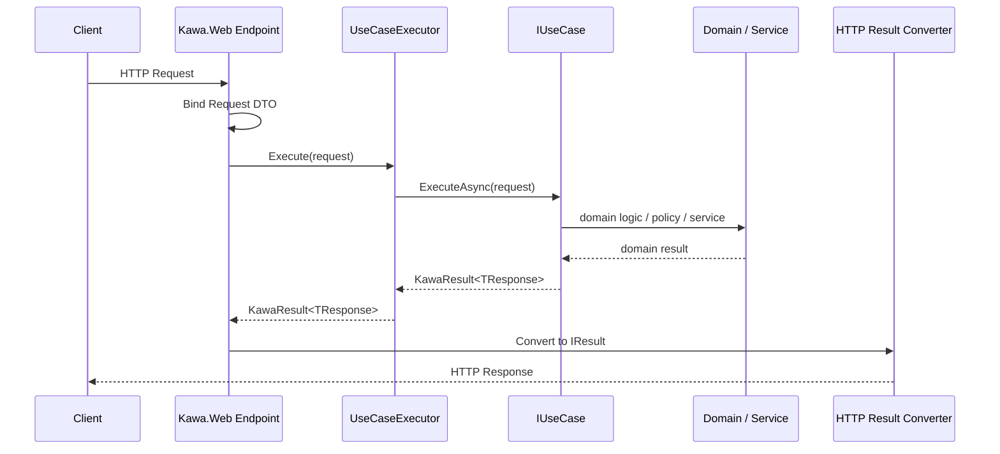

This separates the HTTP layer from the UseCase layer.

A UseCase does not need to know that it is being called from HTTP.

---

## 5. One-way Flow Principle

Kawa keeps processing flow one-way by default.

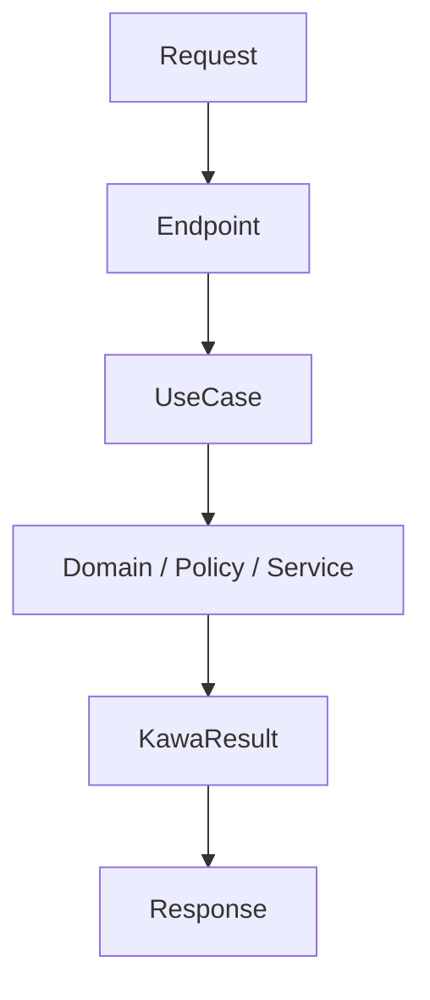

Lower layers do not know higher layers.  
Domain does not know Web.  
Core does not know ASP.NET Core.  
UseCases do not know HTTP.

This does not mean that values never return upward.  
It means that **dependency direction and responsibility knowledge do not flow backward**.

> A river does not flow backward.

---

## 6. Composition over orchestration

Kawa encapsulates individual responsibilities in small classes or functions.  
However, it should not hide the overall business flow too much.

- Small responsibilities are encapsulated in lower-level classes or functions.
- UseCases explicitly compose those pieces.
- DI is used for dependency resolution.
- Business order and decision logic should not be buried inside DI configuration.
- Abstraction should be introduced only where replaceability is actually needed.

Source files should follow the same discipline.

- One source file should serve one clear responsibility.
- File names should state that responsibility and usually match the primary type or module they contain.
- Contracts, results, errors, UseCases, endpoints, and tests should be split when combining them would blur ownership or purpose.
- A source file may contain closely scoped supporting code only when separating it would make the responsibility less clear.

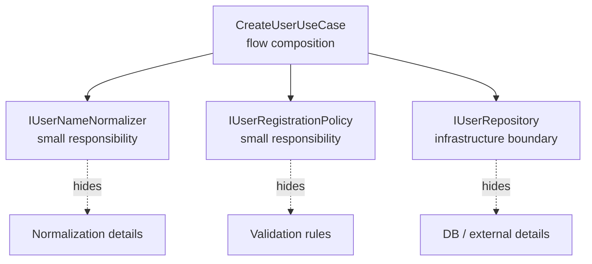

Design motto:

> Hide individual responsibilities.  
> Do not over-hide the flow.

---

## 7. Result / Error Model

Kawa should not overuse exceptions.

Predictable business failures should be represented with `KawaResult<T>` and `KawaError`.

Examples:

- Validation error
- Not found
- Unauthorized
- Forbidden
- Conflict
- Domain rule violation
- Unknown error

Basic HTTP conversion rules are:

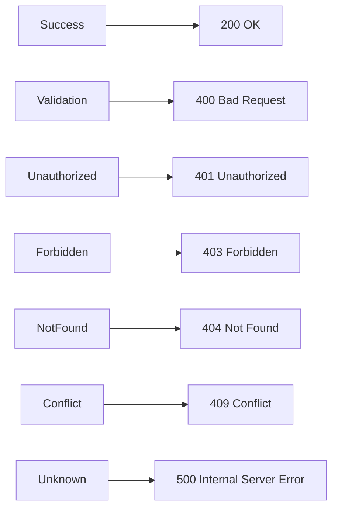

This conversion is handled by Kawa.Web.  
Kawa.Core does not know HTTP status codes.

---

## 8. C# / F# Mixed Usage Policy

### 8.1 Keep boundaries C# friendly

Public APIs should be natural to use from C#.

```csharp
public interface IUseCase<TRequest, TResponse>
{
    ValueTask<KawaResult<TResponse>> ExecuteAsync(
        TRequest request,
        CancellationToken cancellationToken);
}
```

This allows the same interface to be implemented from both C# and F#.

---

### 8.2 Let F# shine in internal representation

F# implementations may freely use discriminated unions, option, result, and function composition internally.

However, before crossing Web or public boundaries, F# internal models should be converted into C# friendly DTOs or `KawaResult<T>`.

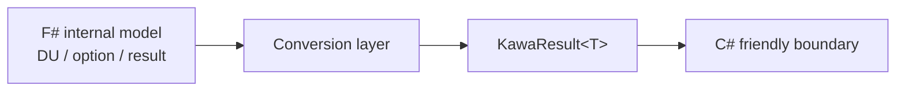

---

### 8.3 Do not force a language choice

Kawa enables F#, but does not require F#.

Kawa can be used with C# only.  
F# can be introduced partially.  
Complex rules or domain logic can be extracted into F# where useful.

---

## 9. Minimal API Policy

Kawa's first Web API integration uses Minimal API.

Example:

```csharp
app.MapKawaPost<CreateUserRequest, CreateUserResponse>("/users");
```

Kawa.Web should perform the following steps:

1. Bind `CreateUserRequest` from the HTTP request
2. Resolve `IUseCase<CreateUserRequest, CreateUserResponse>` from DI
3. Execute it through `UseCaseExecutor`
4. Convert `KawaResult<CreateUserResponse>` into an HTTP response

Users should not write business logic inside endpoints.

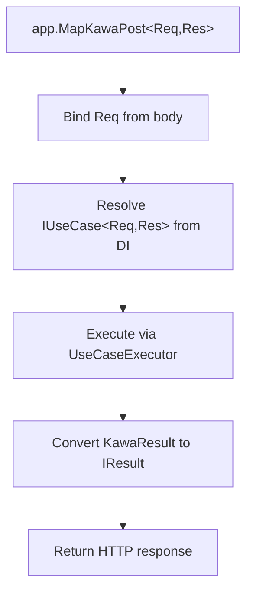

---

## 10. Future Extensions

Kawa starts small, but may later support the following extensions.

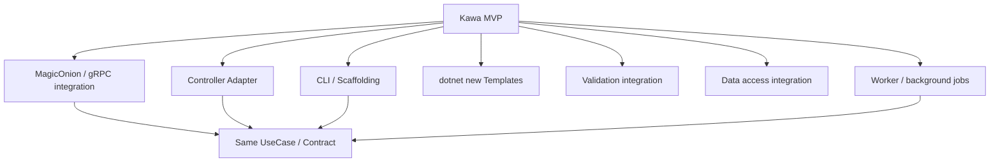

### 10.1 Controller Adapter

Provide an adapter for existing ASP.NET Core MVC projects to call Kawa UseCases from controllers.

However, Minimal API remains the center of Kawa.

---

### 10.2 MagicOnion / gRPC integration

Consider integration with MagicOnion or gRPC as contract-first RPC layers.

The same UseCase should be able to flow into both HTTP APIs and RPC APIs.

---

### 10.3 CLI / Scaffolding

Provide a CLI for a Rails-like development experience.

Example:

```bash
dotnet kawa new webapp MyApp
dotnet kawa generate usecase CreateUser --lang csharp
dotnet kawa generate usecase CreateUser --lang fsharp
dotnet kawa generate endpoint CreateUser --method post --path /users
```

---

### 10.4 Templates

Provide `dotnet new` templates.

- C# only
- Mixed C# / F#
- API only
- Web + Worker
- MagicOnion enabled

---

### 10.5 Validation

Validation should not start as a large framework.

Future options include:

- FluentValidation integration
- DataAnnotations integration
- F# validation helpers
- Validation hooks through pipelines

---

### 10.6 Data Access

Kawa does not force any ORM.

However, Kawa may later provide EF Core integration.

- Transaction pipeline
- Unit of Work abstraction
- Repository helper
- EF Core integration

Kawa.Core must not depend on EF Core.

---

## 11. Design Non-goals and Restrictions

The initial design of Kawa should avoid:

- Replacing ASP.NET Core
- Making controllers the center
- Introducing HTTP concepts into Core
- Adding ASP.NET Core dependencies to Abstractions
- Leaking F#-specific types into public APIs
- Adding EF Core or authentication from the beginning
- Depending on MediatR
- Introducing code generation too early
- Over-engineering
- Creating god classes
- Placing framework logic in samples

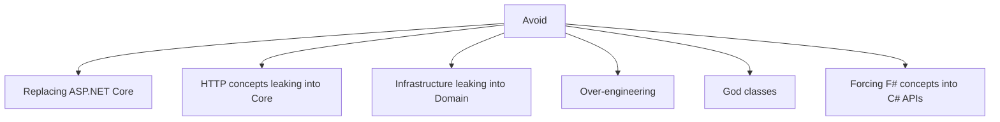

---

## 12. Design Metaphor

Kawa is a river.

- C# is the great river.
- F# is a clear stream.
- Contracts are waterways.
- UseCases are flows.
- Endpoints are gates.
- Pipelines are tributary junctions.
- Results are water quality checks.
- Core is the riverbed.

Kawa does not build a castle.  
Kawa builds waterways.

It does not dominate by force.  
It lets applications flow naturally.

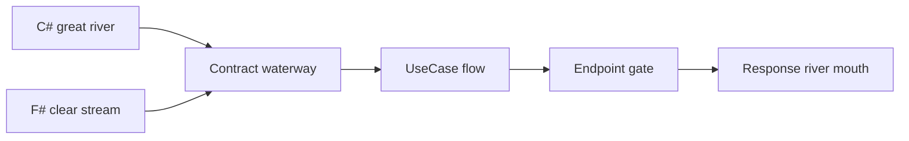

---

## 13. First MVP

The first implementation scope is as follows.

### Projects

```text
src/
  Kawa.Abstractions/
  Kawa.Core/
  Kawa.Web/
  Kawa.FSharp/

samples/
  Kawa.Sample.CSharp/
  Kawa.Sample.Mixed/

tests/
  Kawa.Abstractions.Tests/
  Kawa.Core.Tests/
  Kawa.Web.Tests/
```

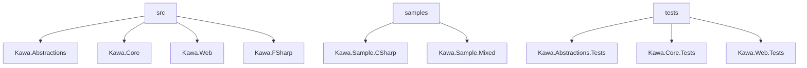

### MVP Features

- `IUseCase<TRequest,TResponse>`
- `KawaResult<T>`
- `KawaError`
- `KawaErrorKind`
- `UseCaseExecutor`
- `MapKawaPost<TRequest,TResponse>`
- Result to HTTP conversion
- C# sample UseCase
- F# sample UseCase
- Basic tests

### MVP Non-goals

- EF Core
- Auth
- Controllers
- MagicOnion
- CLI
- Code generation
- Templates
- Full validation framework
- Complex pipeline behaviors

---

## 15. Advantages of Writing Business Logic in F#

Kawa allows UseCases and domain logic to be implemented in either C# or F#.

F# is not required.  
Kawa can be used entirely with C#.

However, when dealing with complex business rules, state transitions, conditional branching, rights evaluation, pricing, revenue sharing, and validation, F# can be a powerful choice for expressing business logic more safely and clearly.

### 15.1 Business states can be made explicit with types

Business logic often cannot be represented by simple `true / false`.

For example, permission evaluation may result in:

- Allowed
- Denied
- Requires license
- Requires human review
- Unknown

F# can represent these states naturally with discriminated unions.

```fsharp
type PermissionDecision =
    | Allowed
    | Denied of reason: string
    | RequiresLicense of licenseUrl: string
    | RequiresReview of reason: string
    | Unknown of reason: string
```

This makes possible business states explicit in code.

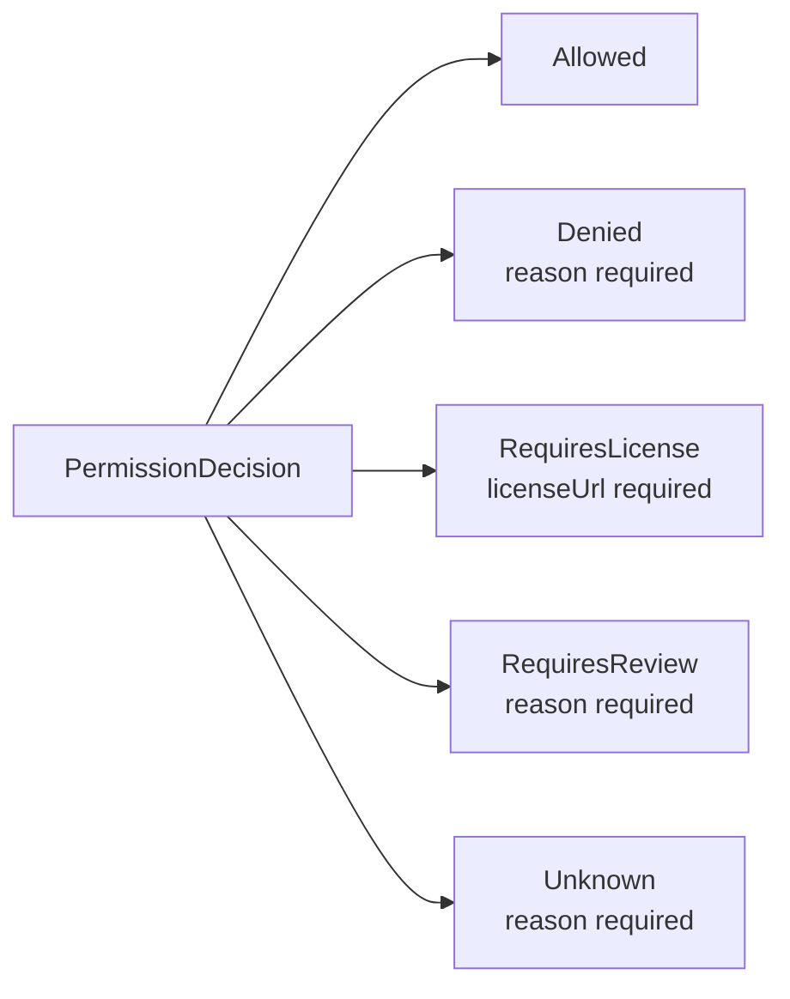

---

### 15.2 Invalid states are harder to create

C# can represent results with `record` and `enum`.

```csharp
public sealed record PermissionResult(
    PermissionStatus Status,
    string? Reason,
    string? LicenseUrl
);
```

However, this shape allows invalid combinations, such as `Status == RequiresLicense` while `LicenseUrl == null`.

With an F# discriminated union, `RequiresLicense` can require `licenseUrl`.

```fsharp
type PermissionDecision =
    | Allowed
    | Denied of reason: string
    | RequiresLicense of licenseUrl: string
```

In this way, F# makes it easier to make invalid states unrepresentable.

For Kawa, this is a major advantage when handling complex domain logic.

---

### 15.3 Pattern matching fits business rules well

Business rules often involve many branches:

- This usage is denied
- This usage is allowed if the user has a subscription
- Commercial use requires an additional license
- If one component asset denies a use, the composite also denies it
- Unknown usage requires review

F# pattern matching can express this kind of branching clearly.

```fsharp
let evaluate usage policy =
    match policy.GetPermission usage with
    | Some "allowed" ->
        Allowed
    | Some "denied" ->
        Denied $"Usage '{usage}' is denied."
    | Some "requires_license" ->
        RequiresLicense policy.LicenseUrl
    | _ ->
        Unknown $"Usage '{usage}' is not defined."
```

This makes it easy to map business rule structure directly into code.

---

### 15.4 Side effects are easier to separate

Many business rules can be written as pure evaluation.

However, as implementations grow, rule evaluation can easily become mixed with:

- DB access
- External API calls
- Logging
- State mutation
- HTTP concerns
- DI concerns

F# makes it natural to express business rules as pure functions.

```fsharp
evaluatePolicy : UsageRequest -> ResourcePolicy -> PermissionDecision
```

Such a function only receives input and returns a decision.  
It is separated from HTTP, DB, and external APIs, making it easier to test and reuse.

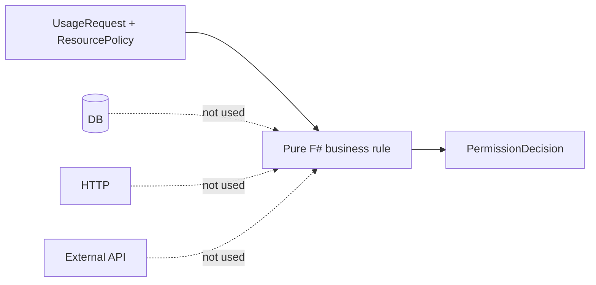

---

### 15.5 Small rules are easy to compose

Kawa values small responsibilities composed at a higher level.

F# is well suited for composing small functions into rules.

```fsharp
let denyIfTraining request =
    if request.UsageType = "model_training" then
        Some (Denied "Model training is prohibited.")
    else
        None

let requireLicenseIfCommercial request =
    if request.IsCommercial then
        Some (RequiresLicense request.Policy.LicenseUrl)
    else
        None

let evaluate rules request =
    rules
    |> List.tryPick (fun rule -> rule request)
    |> Option.defaultValue Allowed
```

Individual rules stay small, and final evaluation composes them.

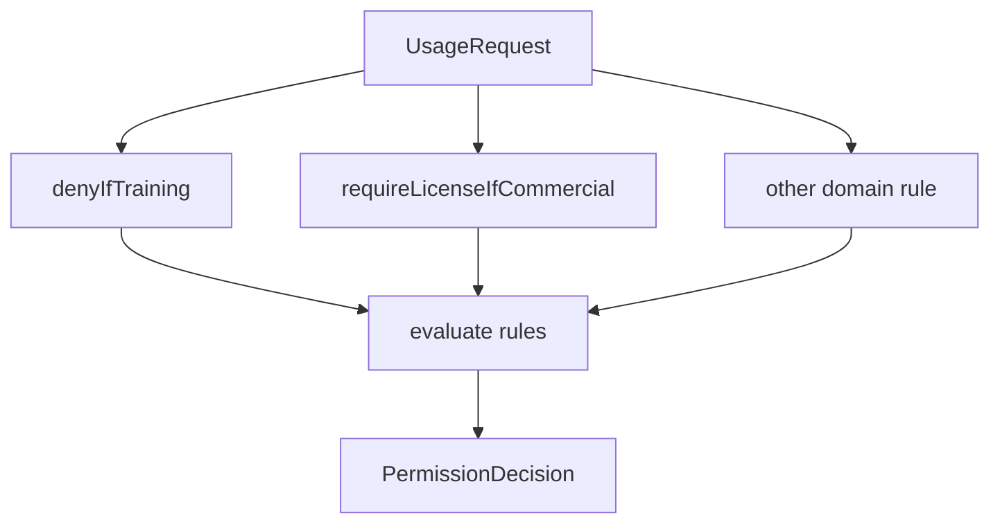

This fits Kawa's `Composition over orchestration` principle.

---

### 15.6 Option / Result make failures explicit

In F#, absence can be represented with `Option`.  
Success and failure can be represented with `Result`.

This reduces overreliance on `null` and exceptions for predictable business failures.

Inside Kawa, F# internal `Result` / `Option` values can be converted into `KawaResult<T>` at the boundary.

```mermaid
flowchart LR
    FSharpResult[F# Result / Option]
    Convert[Convert]
    KawaResult[KawaResult&lt;T&gt;]
    Web[Kawa.Web]
    Response[HTTP Response]

    FSharpResult --> Convert --> KawaResult --> Web --> Response
```

This allows F# implementations to remain idiomatic internally while exposing a unified C# friendly `KawaResult<T>` externally.

---

### 15.7 Testing becomes easier

Business rules written as pure functions are easy to test.

Tests can verify input and output without preparing DB, HTTP, DI, or external APIs.

```fsharp
let result = evaluatePolicy request policy

result = Denied "LoRA training is prohibited."
```

This improves confidence in business logic.

F# is especially useful in Kawa for:

- Rights policy evaluation
- Pricing calculation
- Revenue sharing
- State transitions
- Composite condition merging
- Input validation rules
- Workflow branching
- Domain rules with many exceptional cases

---

### 15.8 Division of responsibilities between C# and F#

Kawa does not require everything to be written in F#.

C# is strong at connecting applications to the real runtime environment: ASP.NET Core, Minimal API, DI, DTOs, OpenAPI, EF Core, and infrastructure.

F# is strong at expressing business rules themselves without muddying the logic.

```mermaid
flowchart TD
    CSharp[C#]
    FSharp[F#]
    Web[Web / API / DI / Infrastructure]
    Logic[Business Logic / Rules / State transitions]
    Boundary[Kawa Abstractions<br/>C# friendly boundary]

    CSharp --> Web
    FSharp --> Logic
    Web --> Boundary
    Logic --> Boundary
```

In one sentence:

> C# is strong at connecting business applications to reality, while F# is strong at expressing business rules without muddying them.

Kawa is a framework that lets both flow into the same river.

---

## 16. One-sentence Summary

Kawa is a contract-first .NET web framework that lays a thin waterway on top of ASP.NET Core and lets UseCases / Domain Logic written in C# and F# flow naturally into Minimal APIs and future RPC entry points.

Kawa is not a framework that dominates.  
Kawa is a framework that shapes the flow.
