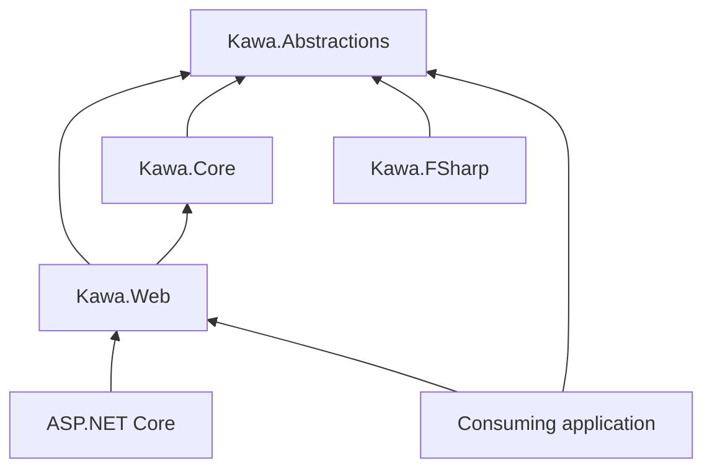
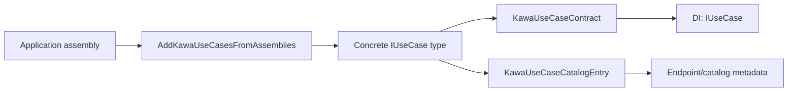
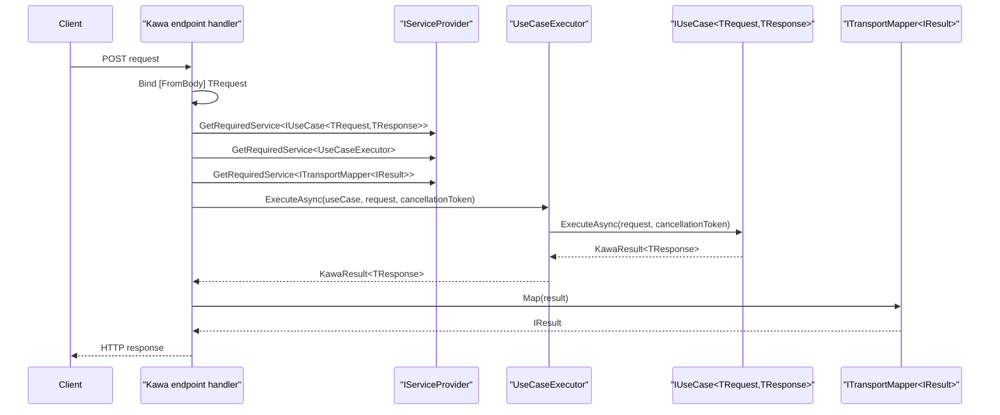
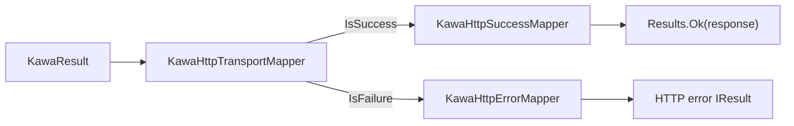
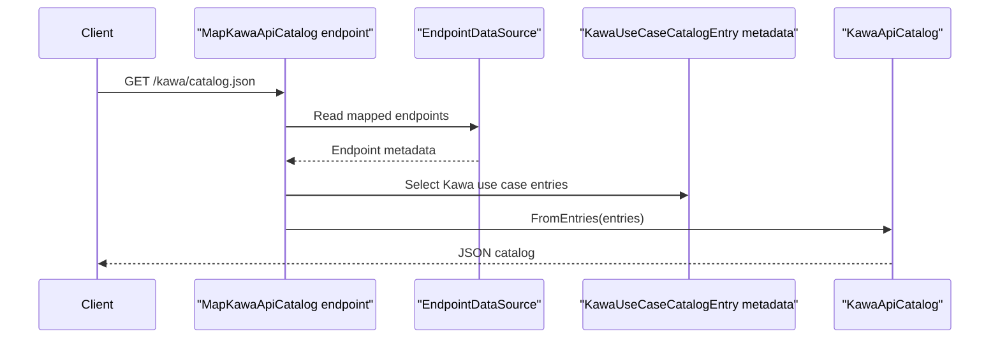
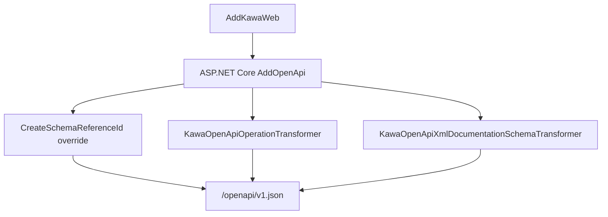
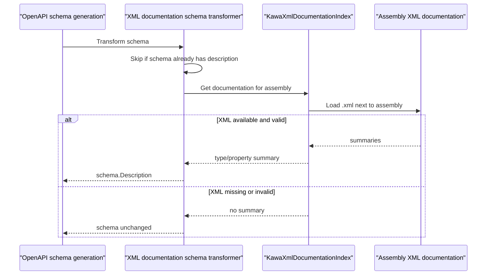

# Kawa 内部設計

## Architecture Overview

Kawa は transport boundary によって分割します。

`Kawa.Abstractions` は ASP.NET Core に依存してはいけない contract を所有します。Use case contract、result/error type、catalog metadata、mapper abstractions が含まれます。

`Kawa.Core` は transport-independent な実行を所有します。`Kawa.Abstractions` には依存できますが、`Kawa.Web` に依存してはいけません。

`Kawa.Web` は ASP.NET Core Minimal API 統合を所有します。Kawa contract を HTTP endpoint、HTTP result mapping、API catalog endpoint、OpenAPI metadata、documentation UI middleware に適合させます。

`Kawa.FSharp` は language helper を所有します。Transport adapter にならないようにします。

Dependency direction は一方向に保ちます。Web は Core と Abstractions に依存し、Core は Abstractions に依存し、Abstractions は Web に依存しません。

## Public Contract Ownership

`Kawa.Abstractions` の型は、最も安定させるべき public contract surface です。`IUseCase<TRequest,TResponse>`、`KawaResult<T>`、`KawaError`、`KawaErrorKind`、metadata attributes、catalog records、mapper interfaces への変更は user-visible compatibility change として扱います。

`Kawa.Web` の型は ASP.NET Core application 向けの public integration API です。Service registration methods、endpoint mapping methods、route defaults、HTTP mappings、OpenAPI behavior、Swagger/ReDoc helpers への変更は user-visible です。

Internal implementation は変更できますが、maintainer は、意図的な breaking change として changelog と versioning に反映する場合を除き、documented behavior を維持してください。

## UseCase Discovery and Registration

`AddKawaUseCasesFromAssemblies` は、指定された assembly から concrete class を scan します。対象になる型は class、not abstract、generic parameter を含まない型です。

対象型は `KawaUseCaseContract.IsUseCaseType` で確認されます。各 use case type について、Kawa は次を作成します。

- `KawaUseCaseCatalog.FromUseCaseType` から `KawaUseCaseCatalogEntry`
- `KawaUseCaseContract.FromUseCaseType` から `KawaUseCaseContract`

Catalog entry は singleton として登録されます。Use case implementation は、発見された `IUseCase<TRequest,TResponse>` interface の singleton として登録されます。

これにより、endpoint execution は interface contract 経由で use case を解決しつつ、catalog と OpenAPI metadata は concrete use case type から導出できます。

## Execution Flow

`MapKawaPost<TUseCase>` は concrete use case type から request/response contract を読み取り、generic mapping path に委譲します。

`MapKawaPost<TRequest,TResponse>` は ASP.NET Core POST endpoint を map します。生成される handler は次の順に処理します。

1. request body を `TRequest` として bind する
2. dependency injection から `IUseCase<TRequest,TResponse>` を解決する
3. `UseCaseExecutor` を解決する
4. `ITransportMapper<IResult>` を解決する
5. executor 経由で use case を実行する
6. `KawaResult<TResponse>` を ASP.NET Core `IResult` に map する

`UseCaseExecutor` は意図的に薄く保ちます。渡された use case の `ExecuteAsync` を呼び出し、cancellation token を渡します。

## HTTP Transport Mapping

HTTP mapping は小さな service に分割します。

`KawaHttpSuccessMapper` は成功した `KawaResult<T>` value を HTTP success response に map します。

`KawaHttpErrorMapper` は `KawaError` value を HTTP failure response に map します。

`KawaHttpTransportMapper` は `KawaResult<T>.IsSuccess` に基づき、success mapper または error mapper を選びます。

この分割により、public transport mapper abstraction を将来の transport でも利用しやすくしながら、HTTP-specific response choice は Web package が所有できます。

## API Catalog Generation

`MapKawaApiCatalog()` は設定された catalog route に GET endpoint を map します。default route は `/kawa/catalog.json` です。

Request time に endpoint は `EndpointDataSource` を読み取り、`KawaUseCaseCatalogEntry` 型の endpoint metadata を見つけ、それらの entry を `KawaApiCatalog` に変換します。

この設計では、catalog は dependency injection に登録された全 use case ではなく、mapped endpoint を表します。登録済みでも map されていない use case は HTTP catalog に出るべきではありません。

Catalog は transport-independent のままです。Metadata は Kawa use case attributes と Kawa contract type から来るものであり、HTTP-specific DTO から来るものではありません。

## OpenAPI Integration

`AddKawaWeb()` は `AddOpenApi` を呼び出し、Kawa-specific な OpenAPI behavior を設定します。

- nested contract type naming のために `CreateSchemaReferenceId` を置き換えます。
- `KawaOpenApiOperationTransformer` が Kawa metadata から operation を enrich します。
- `KawaOpenApiXmlDocumentationSchemaTransformer` が XML documentation から schema を enrich します。

Nested schema reference rule が必要なのは、Kawa contract が nested `Request` / `Response` type name をよく使うためです。Default の短い schema ID は use case 間で衝突する可能性があります。Kawa は nested type full name を使い、`+` を `.` に置き換えることで、generated client が endpoint を正しい request/response schema に bind できるようにします。

`MapKawaPost` が付与する OpenAPI metadata は、実際の HTTP mapper behavior と一貫している必要があります。Status code や response body が mapper 側で変わる場合は、OpenAPI metadata と tests も同じ変更で更新してください。

## XML Documentation Schema Enrichment

`KawaOpenApiXmlDocumentationSchemaTransformer` は contract assembly の隣に出力された XML documentation file を読み取ります。Schema がまだ description を持たない場合、type と property の summary を schema description に map します。

Transformer は fail closed にしてください。XML documentation がない、XML が壊れている、summary entry がない場合は、endpoint generation failure ではなく、追加 description なしとして扱います。

この behavior により、XML comment は generated client に有用な情報を提供できますが、XML documentation を runtime requirement にはしません。

## Test Strategy

Core tests は transport-independent behavior を cover します。対象は `KawaResult<T>`、`UseCaseExecutor`、API catalog conversion です。

Web tests は endpoint mapping、result conversion、service registration、OpenAPI operation metadata、schema reference naming、XML documentation enrichment、language boundary behavior を cover します。

Generated client に影響する変更には OpenAPI regression tests を含めてください。Schema ID と schema description behavior は見た目の documentation ではなく、generated-client contract に関わるものです。

Public HTTP behavior に影響する変更では、mapper tests と OpenAPI metadata tests の両方を更新してください。

## Extension Boundaries

将来の RPC、CLI、Worker adapter は、可能な限り `Kawa.Abstractions` と `Kawa.Core` に依存してください。Transport-independent behavior のために `Kawa.Web` に依存してはいけません。

新しい transport は、HTTP result type を再利用するのではなく、その transport 用の mapper implementation を提供してください。

Use case contract は transport-independent のままにします。Use case に ASP.NET Core、HTTP status code、MagicOnion context、CLI parser type、Worker SDK type への参照を要求してはいけません。

将来の adapter documentation では、implemented package behavior と design direction を明確に区別してください。

