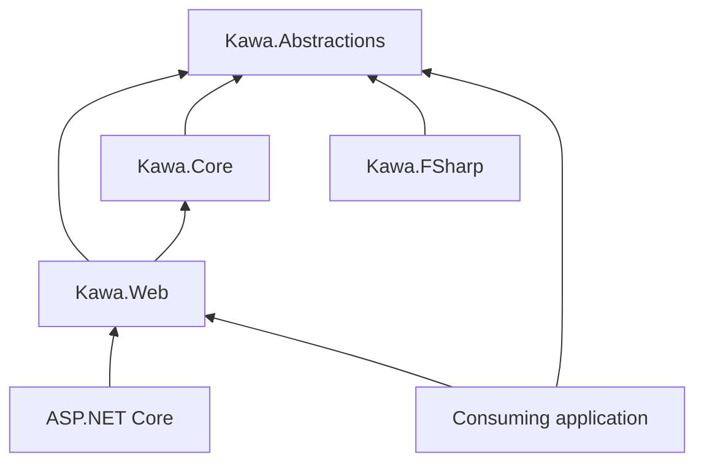
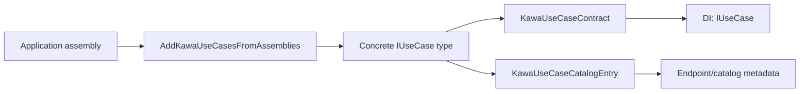
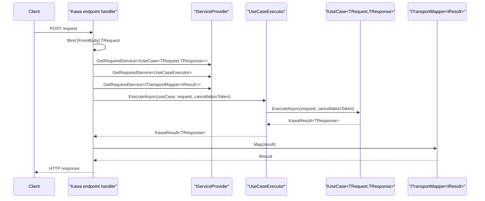
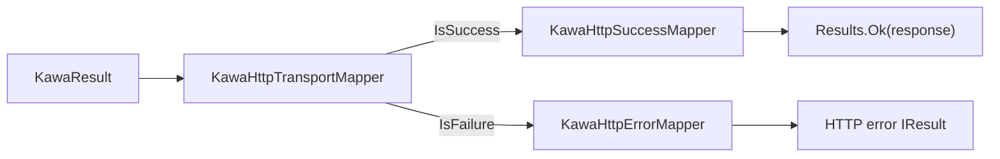
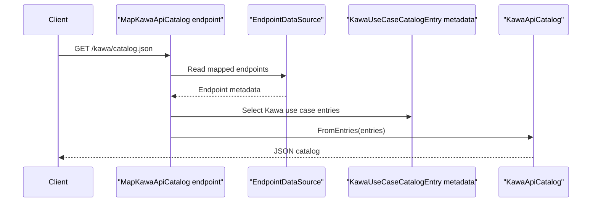
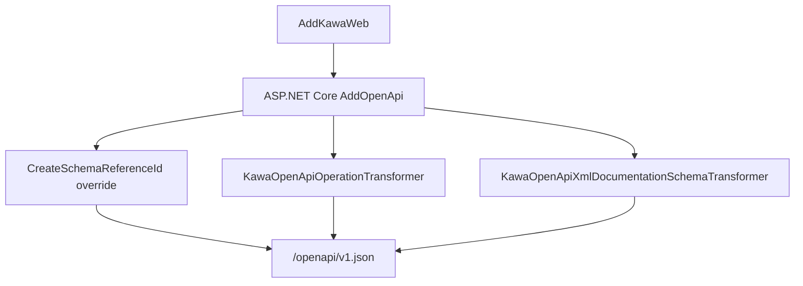
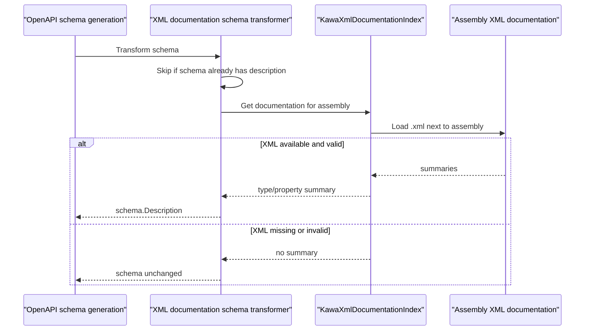

# Kawa Internal Design

## Architecture Overview

Kawa is split by transport boundary.

`Kawa.Abstractions` owns contracts that must not depend on ASP.NET Core. This includes use case contracts, result/error types, catalog metadata, and mapper abstractions.

`Kawa.Core` owns transport-independent execution. It can depend on `Kawa.Abstractions`, but it should not depend on `Kawa.Web`.

`Kawa.Web` owns ASP.NET Core Minimal API integration. It adapts Kawa contracts into HTTP endpoints, HTTP result mapping, API catalog endpoints, OpenAPI metadata, and documentation UI middleware.

`Kawa.FSharp` owns language helpers. It should not become a transport adapter.

Dependency direction should stay one-way: Web depends on Core and Abstractions; Core depends on Abstractions; Abstractions does not depend on Web.

## Public Contract Ownership

Types in `Kawa.Abstractions` are the most stable public contract surface. Changes to `IUseCase<TRequest,TResponse>`, `KawaResult<T>`, `KawaError`, `KawaErrorKind`, metadata attributes, catalog records, or mapper interfaces should be treated as user-visible compatibility changes.

Types in `Kawa.Web` are public integration APIs for ASP.NET Core applications. Changes to service registration methods, endpoint mapping methods, route defaults, HTTP mappings, OpenAPI behavior, or Swagger/ReDoc helpers are user-visible.

Internal implementation can change, but maintainers should preserve documented behavior unless the change is intentionally breaking and reflected in changelog and versioning.

## UseCase Discovery and Registration

`AddKawaUseCasesFromAssemblies` scans supplied assemblies for concrete classes. A type is eligible when it is a class, not abstract, and does not contain generic parameters.

Eligible classes are checked with `KawaUseCaseContract.IsUseCaseType`. For each use case type, Kawa builds:

- a `KawaUseCaseCatalogEntry` from `KawaUseCaseCatalog.FromUseCaseType`
- a `KawaUseCaseContract` from `KawaUseCaseContract.FromUseCaseType`

The catalog entry is registered as a singleton. The use case implementation is registered as a singleton for the discovered `IUseCase<TRequest,TResponse>` interface.

This means endpoint execution resolves use cases through their interface contract, while catalog and OpenAPI metadata can still be derived from the concrete use case type.

## Execution Flow

`MapKawaPost<TUseCase>` reads the request/response contract from the concrete use case type, then delegates to the generic mapping path.

`MapKawaPost<TRequest,TResponse>` maps an ASP.NET Core POST endpoint. The generated handler:

1. binds the request body as `TRequest`
2. resolves `IUseCase<TRequest,TResponse>` from dependency injection
3. resolves `UseCaseExecutor`
4. resolves `ITransportMapper<IResult>`
5. executes the use case through the executor
6. maps the `KawaResult<TResponse>` into an ASP.NET Core `IResult`

`UseCaseExecutor` is intentionally thin. It calls `ExecuteAsync` on the supplied use case and passes through the cancellation token.

## HTTP Transport Mapping

HTTP mapping is split into small services.

`KawaHttpSuccessMapper` maps successful `KawaResult<T>` values to HTTP success responses.

`KawaHttpErrorMapper` maps `KawaError` values to HTTP failure responses.

`KawaHttpTransportMapper` chooses the success or error mapper based on `KawaResult<T>.IsSuccess`.

This split keeps the public transport mapper abstraction usable by future transports while allowing the Web package to own HTTP-specific response choices.

## API Catalog Generation

`MapKawaApiCatalog()` maps a GET endpoint at the configured catalog route. The default route is `/kawa/catalog.json`.

At request time, the endpoint reads `EndpointDataSource`, finds endpoint metadata of type `KawaUseCaseCatalogEntry`, and converts those entries into `KawaApiCatalog`.

This design means the catalog describes mapped endpoints, not every use case registered in dependency injection. A registered use case that is never mapped should not appear in the HTTP catalog.

The catalog remains transport-independent because the metadata comes from Kawa use case attributes and Kawa contract types, not from HTTP-specific DTOs.

## OpenAPI Integration

`AddKawaWeb()` calls `AddOpenApi` and configures Kawa-specific OpenAPI behavior:

- `CreateSchemaReferenceId` is replaced for nested contract type naming.
- `KawaOpenApiOperationTransformer` enriches operations from Kawa metadata.
- `KawaOpenApiXmlDocumentationSchemaTransformer` enriches schemas from XML documentation.

The nested schema reference rule exists because Kawa contracts commonly use nested `Request` and `Response` type names. Default short schema IDs can collide across use cases. Kawa uses the nested type full name with `+` replaced by `.` so generated clients can bind endpoints to the correct request and response schemas.

OpenAPI metadata attached by `MapKawaPost` should remain consistent with the actual HTTP mapper behavior. If a status code or response body changes in the mapper, update OpenAPI metadata and tests in the same change.

## XML Documentation Schema Enrichment

`KawaOpenApiXmlDocumentationSchemaTransformer` reads XML documentation files emitted next to contract assemblies. It maps type and property summaries to schema descriptions when a schema does not already have a description.

The transformer should fail closed. Missing XML documentation, malformed XML, or absent summary entries should result in no additional description rather than endpoint generation failure.

This behavior keeps XML comments useful for generated clients without making XML documentation a runtime requirement.

## Test Strategy

Core tests should cover transport-independent behavior, including `KawaResult<T>`, `UseCaseExecutor`, and API catalog conversion.

Web tests should cover endpoint mapping, result conversion, service registration, OpenAPI operation metadata, schema reference naming, XML documentation enrichment, and language boundary behavior.

Any change that affects generated clients should include OpenAPI regression tests. Schema ID and schema description behavior are generated-client contract concerns, not cosmetic documentation concerns.

Any change that affects public HTTP behavior should update both mapper tests and OpenAPI metadata tests.

## Extension Boundaries

Future RPC, CLI, and Worker adapters should depend on `Kawa.Abstractions` and `Kawa.Core` where possible. They should not depend on `Kawa.Web` for transport-independent behavior.

New transports should provide their own mapper implementations instead of reusing HTTP result types.

Use case contracts must remain transport-independent. Do not require use cases to reference ASP.NET Core, HTTP status codes, MagicOnion context, CLI parser types, or Worker SDK types.

Future adapter documentation should clearly distinguish implemented package behavior from design direction.

