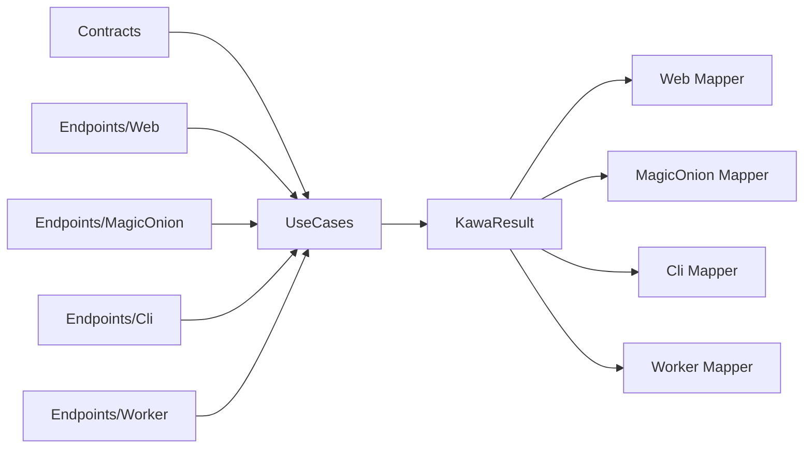

# Kawa Rails-like Convention Proposal

この文書は、Kawa の Rails 的な規約案である。

目的は、ASP.NET Core、MagicOnion、CLI、Worker などの入口を増やしても、アプリケーションの中心を常に Contract と UseCase に置くことである。

Kawa は contract-first である。
HTTP endpoint、RPC service、CLI command、Worker handler は、UseCase を外部に公開するための Transport Adapter にすぎない。

---

## 1. 基本原則

Kawa のアプリケーションは、次の順序で読む。

1. `Contracts/`
2. `UseCases/`
3. `Endpoints/`
4. `Transports/`

中心は `Contracts/` と `UseCases/` である。

`Endpoints/` と `Transports/` は外側の層であり、UseCase の都合ではなく Transport の都合を閉じ込める場所として扱う。



---

## 2. Directory Convention

推奨するプロジェクト構成:

```text
MyApp/
  Contracts/
    Users/
      CreateUser.cs
      GetUser.cs
    Billing/
      CreateInvoice.cs

  UseCases/
    Users/
      CreateUserUseCase.cs
      GetUserUseCase.cs
    Billing/
      CreateInvoiceUseCase.cs

  Endpoints/
    Web/
      UsersEndpoints.cs
      BillingEndpoints.cs
    MagicOnion/
      UsersService.cs
    Cli/
      UsersCommands.cs
    Worker/
      BillingJobs.cs

  Transports/
    Web/
      WebResultMapper.cs
      WebErrorMapper.cs
      WebTransportMapper.cs
    MagicOnion/
      MagicOnionResultMapper.cs
      MagicOnionErrorMapper.cs
      MagicOnionTransportMapper.cs
    Cli/
      CliResultMapper.cs
      CliErrorMapper.cs
      CliTransportMapper.cs
    Worker/
      WorkerResultMapper.cs
      WorkerErrorMapper.cs
      WorkerTransportMapper.cs
```

小さいアプリでは、`Contracts/Users/CreateUser.cs` と `UseCases/Users/CreateUserUseCase.cs` だけから始めてよい。
Transport が増えるまでは、`Endpoints/Web/` だけで十分である。

---

## 3. Multi-language Project Convention

Kawa は、1 つの application / solution の中で C#、F#、VB.NET を混在できるようにする。

ただし、混在の単位は source file ではなく project とする。
1 つの `.csproj` / `.fsproj` / `.vbproj` の中に複数言語を混ぜることは標準規約にしない。

推奨構成:

```text
MyApp.Contracts/          # C# project
MyApp.UseCases.CSharp/    # C# project
MyApp.UseCases.FSharp/    # F# project
MyApp.UseCases.VB/        # VB.NET project
MyApp.Web/                # C# ASP.NET Core host
MyApp.Worker/             # optional
```

`Contracts` project は C# を推奨する。
ここに Kawa の `Request` / `Response` / shared error contract を置く。

F# や VB.NET の UseCase project は、この C# contract を参照して `IUseCase<TRequest,TResponse>` を実装する。

```text
MyApp.Contracts
  ↑
MyApp.UseCases.CSharp / MyApp.UseCases.FSharp / MyApp.UseCases.VB
  ↑
MyApp.Web / MyApp.MagicOnion / MyApp.Cli / MyApp.Worker
```

この規約により、Transport は UseCase の実装言語を知らなくてよい。
Web、MagicOnion、CLI、Worker は同じ Contract と UseCase interface だけを見る。

---

## 4. Contracts

`Contracts/` は Kawa の公開境界である。

ここに置く型は、UseCase の入力と出力を表す。
これらは単なる汎用 DTO ではなく、Kawa の Request / Response として扱う。

規約:

- Request 型は `Request` という名前にする
- Response 型は `Response` という名前にする
- 1 つの use case contract は 1 ファイルにまとめる
- Contract は Transport を知らない
- Contract は ASP.NET Core、MagicOnion、CLI parser、Worker SDK に依存しない
- Contract は serialization 可能な C# friendly な型にする

例:

```csharp
namespace MyApp.Contracts.Users;

public static class CreateUser
{
    public sealed record Request(string Name, string Email);

    public sealed record Response(Guid UserId, string Name, string Email);
}
```

この場合、Kawa における DTO は `CreateUser.Request` と `CreateUser.Response` である。

`CreateUserDto`、`CreateUserRequestDto`、`CreateUserHttpRequest` のような Transport 都合の DTO は、原則として中心に置かない。
必要な場合は Transport Adapter 側に閉じ込め、Kawa Request / Response へ変換する。

---

## 5. UseCases

`UseCases/` は application flow を置く場所である。

UseCase は Transport 非依存でなければならない。

規約:

- UseCase 型名は `{ContractName}UseCase`
- `IUseCase<TRequest,TResponse>` を実装する
- `TRequest` と `TResponse` は `Contracts/` の Request / Response を使う
- `KawaResult<TResponse>` を返す
- HTTP status code、RPC status、exit code、queue ack/nack を知らない
- ASP.NET Core の `IResult` や `HttpContext` を参照しない
- MagicOnion の service context を参照しない
- CLI parser や Worker SDK の型を参照しない

例:

```csharp
using Kawa.Abstractions;
using MyApp.Contracts.Users;

namespace MyApp.UseCases.Users;

public sealed class CreateUserUseCase
    : IUseCase<CreateUser.Request, CreateUser.Response>
{
    public Task<KawaResult<CreateUser.Response>> ExecuteAsync(
        CreateUser.Request request,
        CancellationToken cancellationToken = default)
    {
        if (string.IsNullOrWhiteSpace(request.Email))
        {
            var error = new KawaError(KawaErrorKind.Validation, "Email is required.");
            return Task.FromResult(KawaResult<CreateUser.Response>.Failure(error));
        }

        var response = new CreateUser.Response(Guid.NewGuid(), request.Name, request.Email);
        return Task.FromResult(KawaResult<CreateUser.Response>.Success(response));
    }
}
```

UseCase が見るのは、Request、依存 service、domain model、KawaResult だけである。

---

## 6. Endpoints

`Endpoints/` は Transport の入口である。

Endpoint の責務は薄く保つ。

規約:

- route、RPC method、CLI command、Worker trigger を宣言する
- Transport から Kawa Request を作る
- UseCase を呼ぶ
- KawaResult を Transport response に変換する
- 業務ロジックを書かない
- validation rule の本体を書かない
- error mapping の分岐を直接書かない

Web endpoint の例:

```csharp
using Kawa.Web;
using MyApp.UseCases.Users;

namespace MyApp.Endpoints.Web;

public static class UsersEndpoints
{
    public static IEndpointRouteBuilder MapUsers(this IEndpointRouteBuilder endpoints)
    {
        endpoints.MapKawaPost<CreateUserUseCase>("/users");
        return endpoints;
    }
}
```

MagicOnion、CLI、Worker でも、UseCase と Contract は同じものを使う。
違うのは Endpoint と Transport Mapper だけである。

---

## 7. OpenAPI / Swagger / ReDoc Convention

Kawa.Web は OpenAPI を contract-first に生成する。

OpenAPI schema の中心は `Contracts/` の `Request` / `Response` である。
`Endpoints/Web/` は route、HTTP method、公開名、tag を宣言する場所であり、schema の中心ではない。

規約:

- `Kawa.Web` を setup すると OpenAPI document を生成できる
- development 環境では Swagger UI と ReDoc を既定で使えるようにする
- production 環境で Swagger UI / ReDoc を公開する場合は明示 opt-in にする
- `MapKawaPost<TUseCase>` は `IUseCase<TRequest,TResponse>` から OpenAPI request / response schema を推論する
- `MapKawaPost<TUseCase>` は UseCase catalog metadata を endpoint name / summary / description / tags に反映する
- `KawaError` / `KawaErrorKind` の response mapping も OpenAPI に反映する
- UseCase に明示されたエラーパターンと Kawa の既定エラーパターンから API catalog を作る
- OpenAPI のためだけの DTO を中心に置かない
- XML comments や contract attribute は `Contracts/` 側に寄せる
- Endpoint 固有の metadata は route name、tag、summary、authorization policy などに限定する

推奨 URL:

```text
/openapi/v1.json
/swagger
/redoc
```

推奨 setup:

```csharp
builder.Services
    .AddKawa()
    .AddKawaUseCasesFromAssemblies(typeof(CreateUserUseCase).Assembly)
    .AddKawaWeb();

var app = builder.Build();

app.MapUsers();
app.MapKawaOpenApi();

if (app.Environment.IsDevelopment())
{
    app.MapKawaSwagger();
    app.MapKawaReDoc();
}
```

OpenAPI の情報源:

```text
Contracts/CreateUser.Request
Contracts/CreateUser.Response
KawaError / KawaErrorKind
IUseCase<CreateUser.Request, CreateUser.Response>
Endpoint route metadata
```

情報源ではないもの:

```text
CreateUserSwaggerDto
CreateUserHttpRequest
Controller-only model
MagicOnion-only model
CLI-only model
```

この規約により、Swagger / ReDoc は Kawa Contract を表示する UI になる。
Swagger / ReDoc の都合で Contract が分岐してはいけない。

---

## 8. UseCase Catalog Convention

UseCase は、API catalog に必要な metadata を自分自身に持てる。

この metadata は Transport 非依存であり、Web では OpenAPI / Swagger / ReDoc に、MagicOnion では RPC catalog に、CLI では command help に、Worker では job catalog に変換できる。

例:

```csharp
[KawaUseCase(
    "users.create",
    Summary = "Create user",
    Description = "Creates a user account.",
    Version = "v1",
    Tags = new[] { "Users" })]
[KawaErrorResponse(KawaErrorKind.Validation, Description = "The supplied user fields are invalid.")]
public sealed class CreateUserUseCase
    : IUseCase<CreateUser.Request, CreateUser.Response>
{
    // ...
}
```

catalog entry の情報源:

```text
UseCase type
IUseCase<TRequest,TResponse>
KawaUseCaseAttribute
KawaErrorResponseAttribute
Kawa default error responses
```

`KawaUseCaseCatalog` は、assembly から UseCase を scan し、次の情報を集める。

```text
UseCase name
summary
description
version
tags
request type
response type
default error responses
declared error responses
```

Transport adapter はこの catalog を読む。
Web adapter は endpoint metadata と OpenAPI に変換する。
RPC adapter は service catalog / method metadata に変換する。
CLI adapter は command list / help に変換する。
Worker adapter は job catalog / retry policy documentation に変換する。

---

## 9. Transport Mappers

Transport 固有の変換は `Transports/{TransportName}/` に置く。

Kawa Core は Transport 非依存の抽象を持ち、各 adapter package が具体実装を持つ。

候補となる抽象:

```csharp
public interface IResultMapper<TTransportResult>
{
    TTransportResult MapSuccess<TResponse>(TResponse response);
}

public interface IErrorMapper<TTransportError>
{
    TTransportError MapError(KawaError error);
}

public interface ITransportMapper<TTransportResult>
{
    TTransportResult Map<TResponse>(KawaResult<TResponse> result);
}
```

役割:

- `IResultMapper<TTransportResult>` は成功時の `Response` を Transport response に変換する
- `IErrorMapper<TTransportError>` は `KawaError` を Transport 固有の error 表現に変換する
- `ITransportMapper<TTransportResult>` は `KawaResult<T>` 全体を Transport result に変換する

Web 実装の例:

```csharp
public sealed class WebTransportMapper : ITransportMapper<IResult>
{
    public IResult Map<TResponse>(KawaResult<TResponse> result)
    {
        if (result.IsSuccess)
        {
            return Results.Ok(result.Value);
        }

        var error = result.Error!;
        return error.Kind switch
        {
            KawaErrorKind.Validation => Results.BadRequest(error),
            KawaErrorKind.Unauthorized => Results.Unauthorized(),
            KawaErrorKind.Forbidden => Results.Forbid(),
            KawaErrorKind.NotFound => Results.NotFound(error),
            KawaErrorKind.Conflict => Results.Conflict(error),
            _ => Results.Problem(error.Message),
        };
    }
}
```

MagicOnion 実装では、同じ `KawaResult<T>` を RPC response、status、exception policy に変換する。

CLI 実装では、標準出力、標準エラー、exit code に変換する。

Worker 実装では、ack、retry、dead-letter、log event に変換する。

---

## 10. Transport Packages

Transport ごとに package を分ける。

```text
Kawa.Abstractions
  IUseCase
  KawaResult
  KawaError
  mapper abstractions

Kawa.Core
  UseCaseExecutor
  pipeline

Kawa.Web
  Minimal API endpoints
  Web transport mapper

Kawa.MagicOnion
  MagicOnion service adapter
  MagicOnion transport mapper

Kawa.Cli
  CLI command adapter
  CLI transport mapper

Kawa.Worker
  Worker adapter
  Worker transport mapper
```

`Kawa.Abstractions` と `Kawa.Core` は ASP.NET Core や MagicOnion に依存しない。

---

## 11. Naming Rules

Contract:

```text
Contracts/{Area}/{Action}.cs
Contracts/Users/CreateUser.cs
```

```csharp
public static class CreateUser
{
    public sealed record Request(...);
    public sealed record Response(...);
}
```

UseCase:

```text
UseCases/{Area}/{Action}UseCase.cs
UseCases/Users/CreateUserUseCase.cs
```

```csharp
public sealed class CreateUserUseCase
    : IUseCase<CreateUser.Request, CreateUser.Response>
```

Endpoint:

```text
Endpoints/{Transport}/{Area}Endpoints.cs
Endpoints/Web/UsersEndpoints.cs
Endpoints/MagicOnion/UsersService.cs
Endpoints/Cli/UsersCommands.cs
Endpoints/Worker/UsersJobs.cs
```

Transport Mapper:

```text
Transports/{Transport}/{Transport}TransportMapper.cs
Transports/Web/WebTransportMapper.cs
Transports/MagicOnion/MagicOnionTransportMapper.cs
```

---

## 12. Contract-first Workflow

新しい機能は、次の順序で追加する。

1. `Contracts/{Area}/{Action}.cs` に `Request` と `Response` を定義する
2. `UseCases/{Area}/{Action}UseCase.cs` で `IUseCase<Request,Response>` を実装する
3. UseCase test を書く
4. 必要な Transport の `Endpoints/` に入口を追加する
5. Transport mapper test を書く

Endpoint から書き始めない。

UseCase の中に Transport 固有の型を入れない。

Transport 固有の DTO を中心の Contract に昇格させない。

---

## 13. Convention Over Configuration

Kawa が自動検出する候補:

- `Contracts/**/{Action}.cs`
- `UseCases/**/*UseCase.cs`
- `Endpoints/Web/*Endpoints.cs`
- `Endpoints/MagicOnion/*Service.cs`
- `Endpoints/Cli/*Commands.cs`
- `Endpoints/Worker/*Jobs.cs`
- `Transports/**/*Mapper.cs`

将来的には、次のような登録 API を提供できる。

```csharp
builder.Services.AddKawa()
    .AddKawaContractsFromAssemblies(typeof(CreateUser).Assembly)
    .AddKawaUseCasesFromAssemblies(typeof(CreateUserUseCase).Assembly)
    .AddKawaWeb();

app.MapKawaEndpoints();
```

ただし最初の実装では、暗黙化しすぎない。
規約が読みやすく、明示的にも書けることを優先する。

---

## 14. Recommended First Cut

最初に固めるべき規約は次の 4 つである。

1. `Contracts/{Area}/{Action}.cs` に `Request` / `Response` を置く
2. `UseCases/{Area}/{Action}UseCase.cs` は `IUseCase<Request,Response>` を実装する
3. `Endpoints/{Transport}/` は UseCase を公開するだけにする
4. `Transports/{Transport}/` は `KawaResult<T>` から Transport result への変換だけを持つ

この形なら、Web で始めた UseCase を MagicOnion、CLI、Worker に流用できる。
また、Contract-first であることがディレクトリ構造から分かる。
