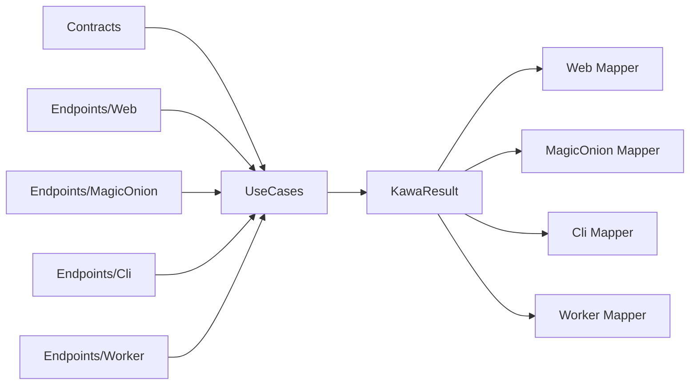

# Kawa Rails-like Convention Proposal

This document proposes Rails-like conventions for Kawa.

The goal is to keep Contracts and UseCases at the center of the application even as entry points expand to ASP.NET Core, MagicOnion, CLI, Worker, and other transports.

Kawa is contract-first.
HTTP endpoints, RPC services, CLI commands, and Worker handlers are only Transport Adapters that expose UseCases to the outside world.

---

## 1. Core Principles

Read a Kawa application in this order:

1. `Contracts/`
2. `UseCases/`
3. `Endpoints/`
4. `Transports/`

`Contracts/` and `UseCases/` are the center.

`Endpoints/` and `Transports/` are outer layers. They contain transport concerns, not UseCase concerns.



---

## 2. Directory Convention

Recommended project structure:

```text
MyApp/
  Contracts/
    Users/
      CreateUser.cs
      GetUser.cs
    Billing/
      CreateInvoice.cs

  UseCases/
    Users/
      CreateUserUseCase.cs
      GetUserUseCase.cs
    Billing/
      CreateInvoiceUseCase.cs

  Endpoints/
    Web/
      UsersEndpoints.cs
      BillingEndpoints.cs
    MagicOnion/
      UsersService.cs
    Cli/
      UsersCommands.cs
    Worker/
      BillingJobs.cs

  Transports/
    Web/
      WebResultMapper.cs
      WebErrorMapper.cs
      WebTransportMapper.cs
    MagicOnion/
      MagicOnionResultMapper.cs
      MagicOnionErrorMapper.cs
      MagicOnionTransportMapper.cs
    Cli/
      CliResultMapper.cs
      CliErrorMapper.cs
      CliTransportMapper.cs
    Worker/
      WorkerResultMapper.cs
      WorkerErrorMapper.cs
      WorkerTransportMapper.cs
```

Small applications may start with only `Contracts/Users/CreateUser.cs` and `UseCases/Users/CreateUserUseCase.cs`.
Until additional transports are needed, `Endpoints/Web/` is enough.

---

## 3. Multi-language Project Convention

Kawa supports mixing C#, F#, and VB.NET inside one application / solution.

However, the unit of language mixing is the project, not the source file.
Mixing multiple languages inside one `.csproj`, `.fsproj`, or `.vbproj` is not the standard convention.

Recommended structure:

```text
MyApp.Contracts/          # C# project
MyApp.UseCases.CSharp/    # C# project
MyApp.UseCases.FSharp/    # F# project
MyApp.UseCases.VB/        # VB.NET project
MyApp.Web/                # C# ASP.NET Core host
MyApp.Worker/             # optional
```

The `Contracts` project should preferably be C#.
It contains Kawa `Request` / `Response` / shared error contracts.

F# and VB.NET UseCase projects reference the C# contract project and implement `IUseCase<TRequest,TResponse>`.

```text
MyApp.Contracts
  ↑
MyApp.UseCases.CSharp / MyApp.UseCases.FSharp / MyApp.UseCases.VB
  ↑
MyApp.Web / MyApp.MagicOnion / MyApp.Cli / MyApp.Worker
```

With this convention, transports do not need to know which language implements a UseCase.
Web, MagicOnion, CLI, and Worker adapters only see the same Contracts and UseCase interface.

---

## 4. Contracts

`Contracts/` is Kawa's public boundary.

Types in this directory represent UseCase inputs and outputs.
They are not generic DTOs; they are Kawa Request / Response contracts.

Rules:

- Request types are named `Request`
- Response types are named `Response`
- One use case contract is kept in one file
- Contracts do not know transports
- Contracts do not depend on ASP.NET Core, MagicOnion, CLI parsers, or Worker SDKs
- Contracts are serialization-friendly, C# friendly types

Example:

```csharp
namespace MyApp.Contracts.Users;

public static class CreateUser
{
    public sealed record Request(string Name, string Email);

    public sealed record Response(Guid UserId, string Name, string Email);
}
```

In this case, the Kawa DTOs are `CreateUser.Request` and `CreateUser.Response`.

Transport-shaped DTOs such as `CreateUserDto`, `CreateUserRequestDto`, or `CreateUserHttpRequest` should not become the center by default.
When they are necessary, keep them inside Transport Adapters and convert them into Kawa Request / Response contracts.

---

## 5. UseCases

`UseCases/` contains application flow.

UseCases must be transport-independent.

Rules:

- UseCase type names use `{ContractName}UseCase`
- UseCases implement `IUseCase<TRequest,TResponse>`
- `TRequest` and `TResponse` come from `Contracts/`
- UseCases return `KawaResult<TResponse>`
- UseCases do not know HTTP status codes, RPC status, exit codes, or queue ack/nack
- UseCases do not reference ASP.NET Core `IResult` or `HttpContext`
- UseCases do not reference MagicOnion service context
- UseCases do not reference CLI parser or Worker SDK types

Example:

```csharp
using Kawa.Abstractions;
using MyApp.Contracts.Users;

namespace MyApp.UseCases.Users;

public sealed class CreateUserUseCase
    : IUseCase<CreateUser.Request, CreateUser.Response>
{
    public Task<KawaResult<CreateUser.Response>> ExecuteAsync(
        CreateUser.Request request,
        CancellationToken cancellationToken = default)
    {
        if (string.IsNullOrWhiteSpace(request.Email))
        {
            var error = new KawaError(KawaErrorKind.Validation, "Email is required.");
            return Task.FromResult(KawaResult<CreateUser.Response>.Failure(error));
        }

        var response = new CreateUser.Response(Guid.NewGuid(), request.Name, request.Email);
        return Task.FromResult(KawaResult<CreateUser.Response>.Success(response));
    }
}
```

A UseCase sees only Request, dependencies, domain models, and KawaResult.

---

## 6. Endpoints

`Endpoints/` is the transport entry point layer.

Endpoint responsibilities stay thin.

Rules:

- Declare routes, RPC methods, CLI commands, or Worker triggers
- Build Kawa Requests from transport input
- Call UseCases
- Convert KawaResult into transport responses
- Do not write business logic
- Do not write validation rule bodies
- Do not branch directly on error mapping

Web endpoint example:

```csharp
using Kawa.Web;
using MyApp.UseCases.Users;

namespace MyApp.Endpoints.Web;

public static class UsersEndpoints
{
    public static IEndpointRouteBuilder MapUsers(this IEndpointRouteBuilder endpoints)
    {
        endpoints.MapKawaPost<CreateUserUseCase>("/users");
        return endpoints;
    }
}
```

MagicOnion, CLI, and Worker adapters use the same UseCases and Contracts.
Only Endpoints and Transport Mappers differ.

---

## 7. OpenAPI / Swagger / ReDoc Convention

Kawa.Web generates OpenAPI in a contract-first way.

The center of the OpenAPI schema is `Contracts/` Request / Response.
`Endpoints/Web/` declares routes, HTTP methods, public names, and tags; it is not the center of the schema.

Rules:

- Setting up `Kawa.Web` makes an OpenAPI document available
- Swagger UI and ReDoc are mapped by the application in development
- Exposing Swagger UI / ReDoc in production is explicit opt-in
- `MapKawaPost<TUseCase>` infers OpenAPI request / response schemas from `IUseCase<TRequest,TResponse>`
- `MapKawaPost<TUseCase>` maps UseCase catalog metadata to endpoint name / summary / description / tags
- `KawaError` / `KawaErrorKind` response mappings are reflected into OpenAPI
- The API catalog is built from declared UseCase error patterns and Kawa default error patterns
- DTOs created only for OpenAPI should not become the center
- XML comments and contract attributes should live near `Contracts/`
- Endpoint-specific metadata should be limited to route name, tags, summary, authorization policy, and similar transport metadata

Recommended URLs:

```text
/openapi/v1.json
/swagger
/redoc
```

Recommended setup:

```csharp
builder.Services
    .AddKawa()
    .AddKawaUseCasesFromAssemblies(typeof(CreateUserUseCase).Assembly)
    .AddKawaWeb();

var app = builder.Build();

app.MapUsers();
app.MapKawaOpenApi();

if (app.Environment.IsDevelopment())
{
    app.MapKawaSwagger();
    app.MapKawaReDoc();
}
```

`MapKawaSwagger()` and `MapKawaReDoc()` are application middleware. They should stay inside an environment or authorization decision when the UI must not be publicly reachable.

OpenAPI sources:

```text
Contracts/CreateUser.Request
Contracts/CreateUser.Response
KawaError / KawaErrorKind
IUseCase<CreateUser.Request, CreateUser.Response>
Endpoint route metadata
```

Not sources:

```text
CreateUserSwaggerDto
CreateUserHttpRequest
Controller-only model
MagicOnion-only model
CLI-only model
```

With this convention, Swagger / ReDoc become UIs for Kawa Contracts.
Contracts must not fork for Swagger / ReDoc convenience.

---

## 8. UseCase Catalog Convention

UseCases may contain the metadata needed for an API catalog.

This metadata is transport-independent. Web adapters can map it to OpenAPI / Swagger / ReDoc; MagicOnion adapters can map it to an RPC catalog; CLI adapters can map it to command help; Worker adapters can map it to a job catalog.

Example:

```csharp
[KawaUseCase(
    "users.create",
    Summary = "Create user",
    Description = "Creates a user account.",
    Version = "v1",
    Tags = new[] { "Users" })]
[KawaErrorResponse(KawaErrorKind.Validation, Description = "The supplied user fields are invalid.")]
public sealed class CreateUserUseCase
    : IUseCase<CreateUser.Request, CreateUser.Response>
{
    // ...
}
```

Catalog entry sources:

```text
UseCase type
IUseCase<TRequest,TResponse>
KawaUseCaseAttribute
KawaErrorResponseAttribute
Kawa default error responses
```

`KawaUseCaseCatalog` scans assemblies for UseCases and collects:

```text
UseCase name
summary
description
version
tags
request type
response type
default error responses
declared error responses
```

Transport adapters read this catalog.
The Web adapter maps it to endpoint metadata and OpenAPI.
The RPC adapter maps it to service catalog / method metadata.
The CLI adapter maps it to command lists / help.
The Worker adapter maps it to job catalog / retry policy documentation.

---

## 9. Transport Mappers

Transport-specific conversion lives under `Transports/{TransportName}/`.

Kawa Core owns transport-independent abstractions. Each adapter package owns its concrete implementation.

Candidate abstractions:

```csharp
public interface IResultMapper<TTransportResult>
{
    TTransportResult MapSuccess<TResponse>(TResponse response);
}

public interface IErrorMapper<TTransportError>
{
    TTransportError MapError(KawaError error);
}

public interface ITransportMapper<TTransportResult>
{
    TTransportResult Map<TResponse>(KawaResult<TResponse> result);
}
```

Responsibilities:

- `IResultMapper<TTransportResult>` maps successful `Response` contracts to transport responses
- `IErrorMapper<TTransportError>` maps `KawaError` to transport-specific error representations
- `ITransportMapper<TTransportResult>` maps the whole `KawaResult<T>` to a transport result

Web implementation example:

```csharp
public sealed class WebTransportMapper : ITransportMapper<IResult>
{
    public IResult Map<TResponse>(KawaResult<TResponse> result)
    {
        if (result.IsSuccess)
        {
            return Results.Ok(result.Value);
        }

        var error = result.Error!;
        return error.Kind switch
        {
            KawaErrorKind.Validation => Results.BadRequest(error),
            KawaErrorKind.Unauthorized => Results.Unauthorized(),
            KawaErrorKind.Forbidden => Results.Forbid(),
            KawaErrorKind.NotFound => Results.NotFound(error),
            KawaErrorKind.Conflict => Results.Conflict(error),
            _ => Results.Problem(error.Message),
        };
    }
}
```

MagicOnion implementations map the same `KawaResult<T>` to RPC response, status, and exception policy.

CLI implementations map to stdout, stderr, and exit code.

Worker implementations map to ack, retry, dead-letter, and log events.

---

## 10. Transport Packages

Each transport has its own package.

```text
Kawa.Abstractions
  IUseCase
  KawaResult
  KawaError
  mapper abstractions

Kawa.Core
  UseCaseExecutor
  pipeline

Kawa.Web
  Minimal API endpoints
  Web transport mapper

Kawa.MagicOnion
  MagicOnion service adapter
  MagicOnion transport mapper

Kawa.Cli
  CLI command adapter
  CLI transport mapper

Kawa.Worker
  Worker adapter
  Worker transport mapper
```

`Kawa.Abstractions` and `Kawa.Core` do not depend on ASP.NET Core or MagicOnion.

---

## 11. Naming Rules

Contract:

```text
Contracts/{Area}/{Action}.cs
Contracts/Users/CreateUser.cs
```

```csharp
public static class CreateUser
{
    public sealed record Request(...);
    public sealed record Response(...);
}
```

UseCase:

```text
UseCases/{Area}/{Action}UseCase.cs
UseCases/Users/CreateUserUseCase.cs
```

```csharp
public sealed class CreateUserUseCase
    : IUseCase<CreateUser.Request, CreateUser.Response>
```

Endpoint:

```text
Endpoints/{Transport}/{Area}Endpoints.cs
Endpoints/Web/UsersEndpoints.cs
Endpoints/MagicOnion/UsersService.cs
Endpoints/Cli/UsersCommands.cs
Endpoints/Worker/UsersJobs.cs
```

Transport Mapper:

```text
Transports/{Transport}/{Transport}TransportMapper.cs
Transports/Web/WebTransportMapper.cs
Transports/MagicOnion/MagicOnionTransportMapper.cs
```

---

## 12. Contract-first Workflow

Add a new feature in this order:

1. Define `Request` and `Response` in `Contracts/{Area}/{Action}.cs`
2. Implement `IUseCase<Request,Response>` in `UseCases/{Area}/{Action}UseCase.cs`
3. Write UseCase tests
4. Add entry points under the required Transport `Endpoints/`
5. Write Transport mapper tests

Do not start from Endpoints.

Do not put transport-specific types inside UseCases.

Do not promote transport-specific DTOs into the central Contract.

---

## 13. Convention Over Configuration

Kawa may auto-detect:

- `Contracts/**/{Action}.cs`
- `UseCases/**/*UseCase.cs`
- `Endpoints/Web/*Endpoints.cs`
- `Endpoints/MagicOnion/*Service.cs`
- `Endpoints/Cli/*Commands.cs`
- `Endpoints/Worker/*Jobs.cs`
- `Transports/**/*Mapper.cs`

Future registration APIs may look like this:

```csharp
builder.Services.AddKawa()
    .AddKawaContractsFromAssemblies(typeof(CreateUser).Assembly)
    .AddKawaUseCasesFromAssemblies(typeof(CreateUserUseCase).Assembly)
    .AddKawaWeb();

app.MapKawaEndpoints();
```

The first implementation should not hide too much.
Prefer conventions that are readable and still explicit when needed.

---

## 14. Recommended First Cut

The first stable conventions should be:

1. Put `Request` / `Response` in `Contracts/{Area}/{Action}.cs`
2. Implement `IUseCase<Request,Response>` in `UseCases/{Area}/{Action}UseCase.cs`
3. Keep `Endpoints/{Transport}/` limited to exposing UseCases
4. Keep `Transports/{Transport}/` limited to converting `KawaResult<T>` into transport results

With this shape, a UseCase that starts on Web can be reused by MagicOnion, CLI, and Worker adapters.
The directory structure also makes the contract-first model visible.
