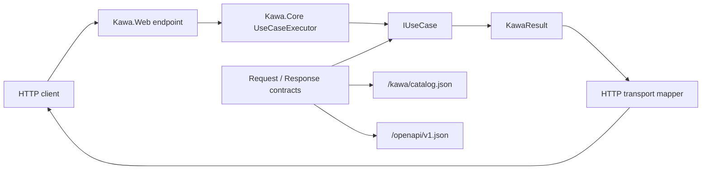
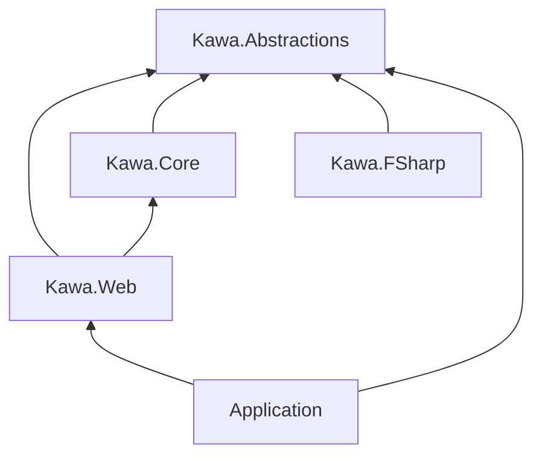
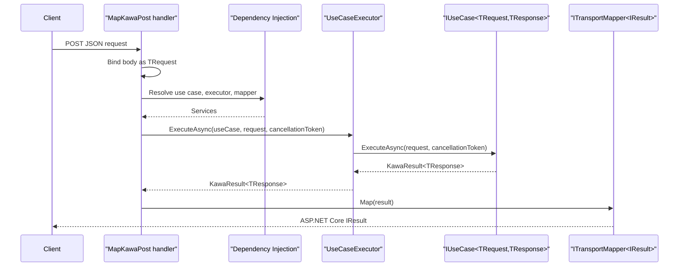
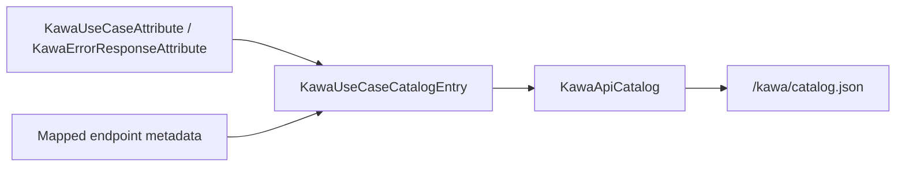

# Kawa 仕様書

## 概要

Kawa は、ASP.NET Core の上に薄いアプリケーション層として構築する contract-first の .NET Web フレームワークです。Kawa は、request/response contract と `IUseCase<TRequest,TResponse>` 実装をアプリケーションの中心に置きます。Hosting、dependency injection、routing、middleware、authentication、authorization、configuration、logging、基盤となる OpenAPI infrastructure は ASP.NET Core の責務です。

現在実装済みの transport は、`Kawa.Web` による ASP.NET Core Minimal API 統合です。RPC、CLI、Worker transport は設計上の方向性であり、このリポジトリで実装済みの package behavior ではありません。



## Package Surface

`Kawa.Abstractions` は transport-independent な contract を含みます。主な型は `IUseCase<TRequest,TResponse>`、`KawaResult<T>`、`KawaError`、`KawaErrorKind`、catalog metadata、mapper abstractions です。

`Kawa.Core` は transport-independent な実行支援を含みます。現在の中心は `UseCaseExecutor` です。

`Kawa.Web` は ASP.NET Core Minimal API 統合、HTTP result mapping、API catalog endpoints、OpenAPI integration、Swagger/ReDoc UI helpers を含みます。

`Kawa.FSharp` は Kawa result values を扱うための F# helper を含みます。



## UseCase Contract

Kawa の use case は `IUseCase<TRequest,TResponse>` を実装します。

```csharp
public interface IUseCase<TRequest, TResponse>
{
    Task<KawaResult<TResponse>> ExecuteAsync(
        TRequest request,
        CancellationToken cancellationToken = default);
}
```

`TRequest` は入力 contract、`TResponse` は成功時の出力 contract です。Kawa は特定の DTO base class を要求しません。推奨規約は、request と response contract を use case の近くに置くことです。一般的には nested `Request` / `Response` record type として定義します。

`AddKawaUseCasesFromAssemblies` は、Kawa use case contract を実装する concrete、non-abstract、non-open-generic class を登録します。発見された use case は、実装している `IUseCase<TRequest,TResponse>` service として登録されます。

`MapKawaPost<TUseCase>` は、use case type がちょうど 1 つの request/response use case contract を表すことを要求します。`MapKawaPost<TRequest,TResponse>` は明示的な request/response contract type で endpoint を map し、request time に対応する `IUseCase<TRequest,TResponse>` を dependency injection から解決します。

## Result and Error Model

Use case は `KawaResult<TResponse>` を返します。

`KawaResult<T>.Success(value)` は成功 result を作成します。成功 result は `IsSuccess == true`、`IsFailure == false`、`Value` を持ち、`Error` を持ちません。

`KawaResult<T>.Failure(error)` は失敗 result を作成します。失敗 result は `IsSuccess == false`、`IsFailure == true`、`Error` を持ち、成功 value を持ちません。

`KawaError` は、`KawaErrorKind` と人間が読める message を持つ、予測可能な application error を表します。

現在の error kind は次の通りです。

| Kind | 意味 |
| --- | --- |
| `Validation` | request は構文上受け付けられたが、application validation rule に違反しています。 |
| `Unauthorized` | caller が authenticated ではありません。 |
| `Forbidden` | caller は authenticated ですが、その operation を実行できません。 |
| `NotFound` | 要求された resource または target が存在しません。 |
| `Conflict` | operation が現在の application state と衝突しています。 |
| `Unknown` | 他の既知 category に当てはまらない failure です。 |

## Web Integration

default の Kawa service は `AddKawa()` で登録します。

```csharp
builder.Services.AddKawa();
```

`AddKawa()` は `UseCaseExecutor`、HTTP success mapper、HTTP error mapper、HTTP transport mapper を登録します。

Use case は `AddKawaUseCasesFromAssemblies` で assembly から登録します。

```csharp
builder.Services.AddKawaUseCasesFromAssemblies(typeof(CreateUser).Assembly);
```

Kawa の OpenAPI convention は `AddKawaWeb()` で登録します。

```csharp
builder.Services.AddKawaWeb();
```

Use case type から POST endpoint を map します。

```csharp
app.MapKawaPost<CreateUser>("/users");
```

明示的な request/response contract type から POST endpoint を map します。

```csharp
app.MapKawaPost<CreateUser.Request, CreateUser.Response>("/users");
```

## HTTP Mapping

`MapKawaPost` は JSON request body を bind し、対応する use case を dependency injection から解決し、`UseCaseExecutor` で実行し、`KawaResult<TResponse>` を ASP.NET Core `IResult` に変換します。



成功 response は、response contract を JSON として serialize した `200 OK` に map されます。

失敗 response は次のように map されます。

| `KawaErrorKind` | HTTP response |
| --- | --- |
| `Validation` | `KawaError` JSON を持つ `400 Bad Request` |
| `Unauthorized` | `401 Unauthorized` |
| `Forbidden` | `403 Forbidden` |
| `NotFound` | `KawaError` JSON を持つ `404 Not Found` |
| `Conflict` | `KawaError` JSON を持つ `409 Conflict` |
| `Unknown` | `ProblemDetails` としての `500 Internal Server Error` |

## API Catalog

`MapKawaApiCatalog()` は Kawa API catalog endpoint を map します。default route は `/kawa/catalog.json` です。

catalog は、mapped Kawa use case の endpoint metadata から生成されます。use case metadata、request/response contract type name、error response metadata を含みます。

Transport-independent な use case metadata は `KawaUseCaseAttribute` で記述します。

```csharp
[KawaUseCase(
    "users.create",
    Summary = "Create user",
    Description = "Creates a user account.",
    Version = "v1",
    Tags = new[] { "Users" })]
```

想定される error response は `KawaErrorResponseAttribute` で記述します。

```csharp
[KawaErrorResponse(KawaErrorKind.Validation, Description = "Name is required.")]
```

catalog は transport-independent です。`Kawa.Web` はこれを HTTP で公開します。将来の adapter は、use case を HTTP に依存させずに同じ metadata を利用できます。



## OpenAPI, Swagger, and ReDoc

`MapKawaOpenApi()` は OpenAPI document endpoint を map します。default route は `/openapi/v1.json` です。

`AddKawaWeb()` は Kawa の OpenAPI behavior を設定します。`CreateUser.Request` や `CreateUser.Response` のような nested contract type は、full nested type name を元にした schema reference ID を使います。このとき `+` は `.` に置き換えます。これにより、generated client が別 use case の同名 nested contract を取り違えにくくなります。

Endpoint が `MapKawaPost<TUseCase>` で map される場合、Kawa は use case metadata を OpenAPI endpoint metadata に map します。

Contract assembly が assembly の隣に XML documentation file を出力している場合、Kawa は type と property の summary を OpenAPI schema description として使用します。Documented contract を定義する project では次を有効にしてください。

```xml
<GenerateDocumentationFile>true</GenerateDocumentationFile>
```

`MapKawaSwagger()` は Swagger UI を map します。default route は `/swagger` です。

`MapKawaReDoc()` は ReDoc を map します。default route は `/redoc` です。

Swagger と ReDoc は application middleware です。推奨 default は development でのみ map することです。Production で公開する場合は、application の明示的な判断として扱ってください。

## Multi-Language Boundary

Kawa は、public boundary が Kawa の C# friendly contract と互換である限り、複数の CLR language で実装された use case を扱えます。

このリポジトリには C#、F#、VB.NET sample が含まれます。Sample は ASP.NET Core host を C# に置きつつ、use case を language-specific project に置けることを示します。

Public request/response contract は、C#、ASP.NET Core serialization、OpenAPI generation、他の CLR language から自然に扱える単純な .NET type にしてください。

## Compatibility and Stability Notes

現在の stable behavior は、Kawa package の public API surface、use case execution contract、ここで記述した HTTP result mapping、API catalog shape、OpenAPI integration behavior です。

Kawa は現在、RPC、CLI、Worker、Controller、EF Core、authentication、authorization、validation framework、code generation、project template package を提供していません。これらは将来検討される可能性がありますが、現在の Kawa behavior として依存しないでください。

Kawa は ASP.NET Core の上に構築されます。そのため、host configuration、middleware ordering、authentication/authorization policy、production documentation exposure、logging、deployment settings は application author の責務です。

