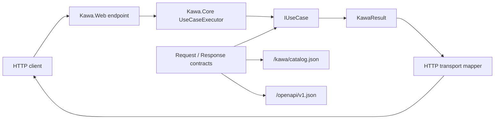
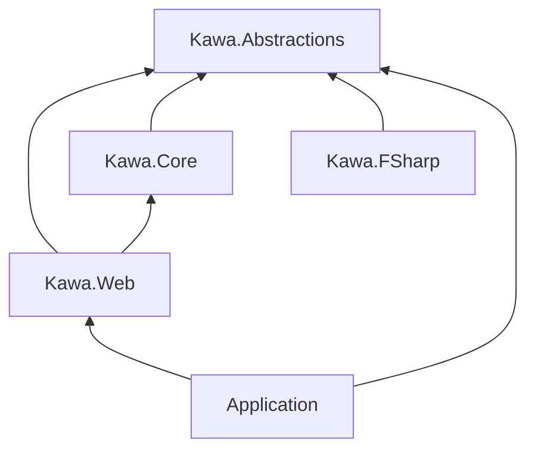
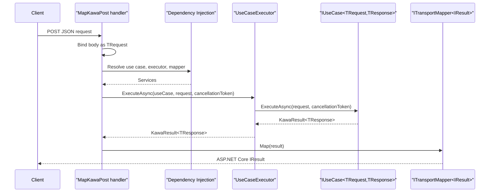
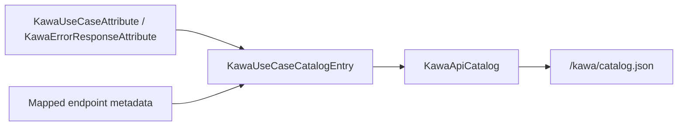

# Kawa Specification

## Overview

Kawa is a contract-first .NET web framework built as a thin application layer on ASP.NET Core. Kawa centers application flow on request/response contracts and `IUseCase<TRequest,TResponse>` implementations. ASP.NET Core remains responsible for hosting, dependency injection, routing, middleware, authentication, authorization, configuration, logging, and the underlying OpenAPI infrastructure.

The current implemented transport is ASP.NET Core Minimal API integration through `Kawa.Web`. RPC, CLI, and Worker transports are design directions, not implemented package behavior in this repository.



## Package Surface

`Kawa.Abstractions` contains the transport-independent contracts: `IUseCase<TRequest,TResponse>`, `KawaResult<T>`, `KawaError`, `KawaErrorKind`, catalog metadata, and mapper abstractions.

`Kawa.Core` contains transport-independent execution support, currently `UseCaseExecutor`.

`Kawa.Web` contains ASP.NET Core Minimal API integration, HTTP result mapping, API catalog endpoints, OpenAPI integration, and Swagger/ReDoc UI helpers.

`Kawa.FSharp` contains F# helpers for working with Kawa result values.



## UseCase Contract

A Kawa use case implements `IUseCase<TRequest,TResponse>`.

```csharp
public interface IUseCase<TRequest, TResponse>
{
    Task<KawaResult<TResponse>> ExecuteAsync(
        TRequest request,
        CancellationToken cancellationToken = default);
}
```

`TRequest` is the input contract and `TResponse` is the successful output contract. Kawa does not require a specific DTO base class. The recommended convention is to keep request and response contracts close to the use case, commonly as nested `Request` and `Response` record types.

`AddKawaUseCasesFromAssemblies` registers concrete, non-abstract, non-open-generic classes that implement a Kawa use case contract. Each discovered use case is registered as its implemented `IUseCase<TRequest,TResponse>` service.

`MapKawaPost<TUseCase>` requires the use case type to describe exactly one request/response use case contract. `MapKawaPost<TRequest,TResponse>` maps an endpoint by explicit request and response contract types and resolves the matching `IUseCase<TRequest,TResponse>` from dependency injection at request time.

## Result and Error Model

Use cases return `KawaResult<TResponse>`.

`KawaResult<T>.Success(value)` creates a successful result. Successful results have `IsSuccess == true`, `IsFailure == false`, a `Value`, and no `Error`.

`KawaResult<T>.Failure(error)` creates a failed result. Failed results have `IsSuccess == false`, `IsFailure == true`, an `Error`, and no successful value.

`KawaError` represents a predictable application error with a `KawaErrorKind` and a human-readable message.

The current error kinds are:

| Kind | Meaning |
| --- | --- |
| `Validation` | The request is syntactically accepted but violates application validation rules. |
| `Unauthorized` | The caller is not authenticated. |
| `Forbidden` | The caller is authenticated but not allowed to perform the operation. |
| `NotFound` | The requested resource or target does not exist. |
| `Conflict` | The operation conflicts with current application state. |
| `Unknown` | The failure does not fit another known category. |

## Web Integration

Register the default Kawa services with `AddKawa()`:

```csharp
builder.Services.AddKawa();
```

`AddKawa()` registers `UseCaseExecutor`, the HTTP success mapper, the HTTP error mapper, and the HTTP transport mapper.

Register use cases from assemblies with `AddKawaUseCasesFromAssemblies`:

```csharp
builder.Services.AddKawaUseCasesFromAssemblies(typeof(CreateUser).Assembly);
```

Register Kawa's OpenAPI conventions with `AddKawaWeb()`:

```csharp
builder.Services.AddKawaWeb();
```

Map a POST endpoint from a use case type:

```csharp
app.MapKawaPost<CreateUser>("/users");
```

Map a POST endpoint from explicit request and response contract types:

```csharp
app.MapKawaPost<CreateUser.Request, CreateUser.Response>("/users");
```

## HTTP Mapping

`MapKawaPost` binds the JSON request body, resolves the matching use case from dependency injection, executes it through `UseCaseExecutor`, and maps the `KawaResult<TResponse>` to an ASP.NET Core `IResult`.



Successful responses map to `200 OK` with the response contract serialized as JSON.

Failure responses map as follows:

| `KawaErrorKind` | HTTP response |
| --- | --- |
| `Validation` | `400 Bad Request` with `KawaError` JSON |
| `Unauthorized` | `401 Unauthorized` |
| `Forbidden` | `403 Forbidden` |
| `NotFound` | `404 Not Found` with `KawaError` JSON |
| `Conflict` | `409 Conflict` with `KawaError` JSON |
| `Unknown` | `500 Internal Server Error` as `ProblemDetails` |

## API Catalog

`MapKawaApiCatalog()` maps the Kawa API catalog endpoint. The default route is `/kawa/catalog.json`.

The catalog is generated from endpoint metadata for mapped Kawa use cases. It includes use case metadata, request and response contract type names, and error response metadata.

Use `KawaUseCaseAttribute` to describe transport-independent use case metadata:

```csharp
[KawaUseCase(
    "users.create",
    Summary = "Create user",
    Description = "Creates a user account.",
    Version = "v1",
    Tags = new[] { "Users" })]
```

Use `KawaErrorResponseAttribute` to document expected error responses:

```csharp
[KawaErrorResponse(KawaErrorKind.Validation, Description = "Name is required.")]
```

The catalog is transport-independent. `Kawa.Web` exposes it over HTTP, and future adapters can use the same metadata without making the use case depend on HTTP.



## OpenAPI, Swagger, and ReDoc

`MapKawaOpenApi()` maps the OpenAPI document endpoint. The default route is `/openapi/v1.json`.

`AddKawaWeb()` configures Kawa OpenAPI behavior. Nested contract types such as `CreateUser.Request` and `CreateUser.Response` use schema reference IDs based on their full nested type names, with `+` replaced by `.`, so generated clients do not confuse same-named nested contracts from different use cases.

Kawa maps use case metadata to OpenAPI endpoint metadata when endpoints are mapped through `MapKawaPost<TUseCase>`.

When a contract assembly emits an XML documentation file next to its assembly, Kawa uses type and property summaries as OpenAPI schema descriptions. Projects that define documented contracts should enable:

```xml
<GenerateDocumentationFile>true</GenerateDocumentationFile>
```

`MapKawaSwagger()` maps Swagger UI. The default route is `/swagger`.

`MapKawaReDoc()` maps ReDoc. The default route is `/redoc`.

Swagger and ReDoc are application middleware. The recommended default is to map them only in development. Production exposure should be an explicit application decision.

## Multi-Language Boundary

Kawa supports use cases implemented from multiple CLR languages as long as the public boundary remains compatible with Kawa's C# friendly contracts.

The repository includes C#, F#, and VB.NET samples. The samples keep the ASP.NET Core host in C# while allowing use cases to live in language-specific projects.

Public request and response contracts should remain simple .NET types that are natural for C#, ASP.NET Core serialization, OpenAPI generation, and other CLR languages to consume.

## Compatibility and Stability Notes

The current stable behavior is the public API surface in the Kawa packages, the use case execution contract, the documented HTTP result mapping, the API catalog shape, and the OpenAPI integration behavior described above.

Kawa does not currently provide implemented RPC, CLI, Worker, Controller, EF Core, authentication, authorization, validation framework, code generation, or project template packages. Those areas may be explored later, but applications should not depend on them as current Kawa behavior.

Because Kawa builds on ASP.NET Core, application authors remain responsible for host configuration, middleware ordering, authentication and authorization policies, production documentation exposure, logging, and deployment settings.

